### FP in MIPS 
**Programmers view** 
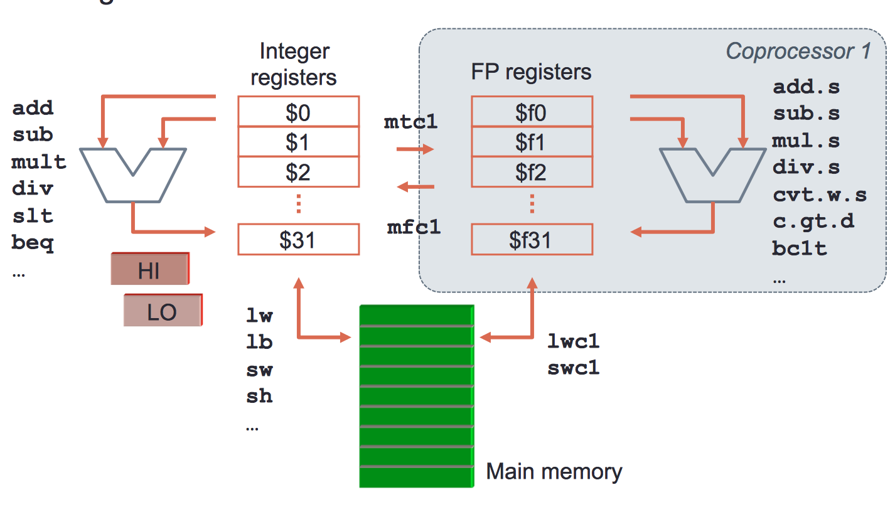

### Data transfer instructions
Data interchange with memory and integer registers
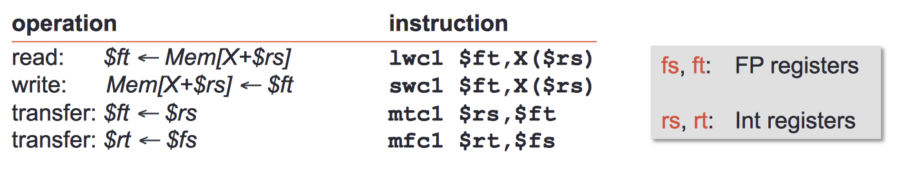
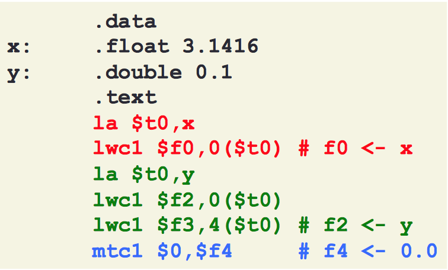

> FP instructions do not handle immediate operands. Constants must be allocated in memory or built into integer registers and then moved

### Type conversion 
+ FP registers may contain 
    + s: Single-precision FP values
    + d: Double-precision FP values 
    + w: 32-bit integer values
+ Type conversion is possible via cvt.\_.\_ fd, fs 
+ In combination with transfers to-from integer registers, values of different types can be used in arithmetic operations

### Exercise 
A = π·$r^2$ 
Input: $a0 radius in mm (integer) 
Output: \($\)f0 = area in $m^2$ 
        *in single precision*
+ Steps
    1. Divide r/1000
    2. calculate $r^2$
    3. Multiply by π 

Area: 

```assembly_x86
mtc1      $a0, $f1          ########################
cvt.s.w   $f1, $f1          # $f1 = r/1000, single #
li.s      $f2, 1000.0       # precision            #
div.s     $f1, $f1, $f2     ########################
mul       $f1, $f1, $f1     # $f1 = $r^2 (m^2) 
li.s      $f1, 3.1415926536
mul.s     $f0, $f1, $f2
jr        $ra
```
> Remember cvt converts from integer to single-precision 

### Comparison instructions
+ Comparison instructions store their result in bit **FPc**
    + TRUE = 1; FALSE = 0
+ FPc is kept in a control register of coprocessor 1 and is used by conditional branch instructions
+ There is a set of comparison instructions for each data type
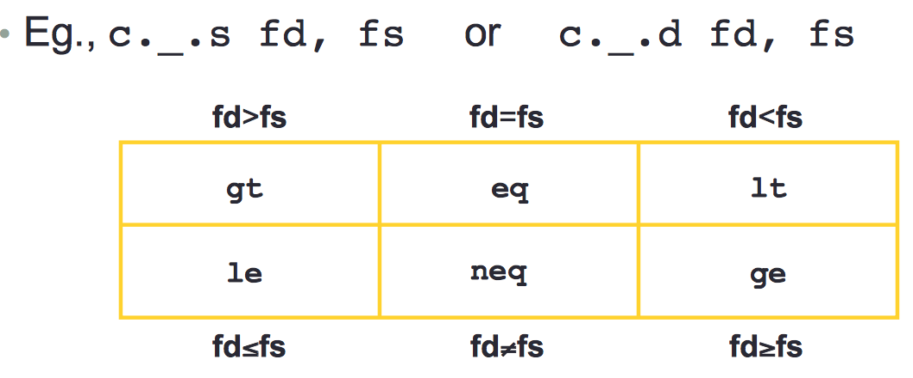

### Flow control 
+ Two conditional branch instructions: 
    + **bclt** *label* - if FPc = 1 then branch to *label*
    + **bclf** *label* - if FPc = 0 then branch to *label* 
+ Combined with comparison instructions, they enable complex conditional branches
+ Each condition accepts two implementations
    + SP example: if (\($\)f0 > \($\)f2) then *branch to label*
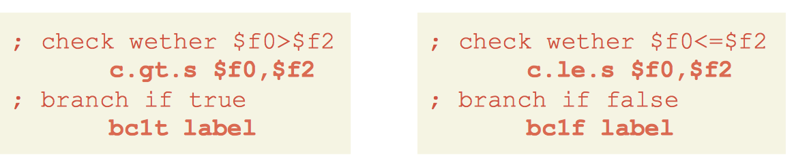

### Floating point operators
+ FP operators take one or two argumens of a given FP format
+ Their output is a standard FP values
    + `With the exection of comparison operators` 
+ They are relatively complex because they must: 
    + Normalize result
    + Handle special values
    + If needed, round the resultt according to the current rounding mode
    + Raise the exceptions dictated by the standard

### Floating point operators: roadmap 
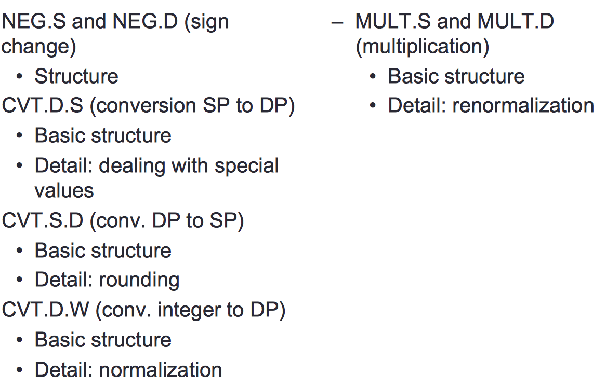

### Sign change operator (neg) 
**Operation** 
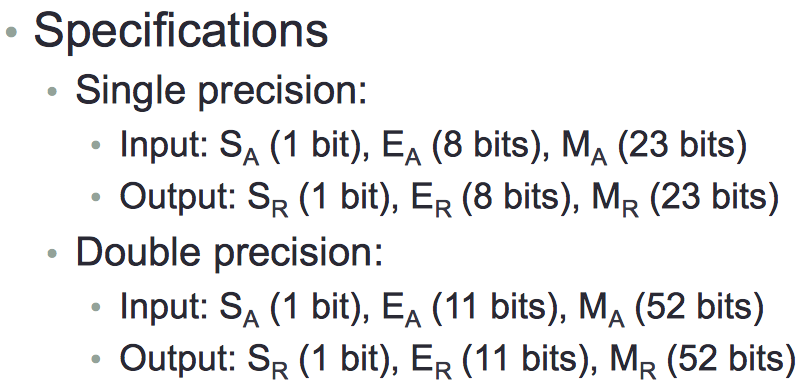
+ Change sign: S<sub>R</sub> = not S<sub>A</sub>
+ Copy exponent: E<sub>R</sub> = E<sub>A</sub>
+ Copy mantissa: M<sub>R</sub> = M<sub>R</sub>

**Software emulation** 
` float x = 1.0; `
` x = -x; `

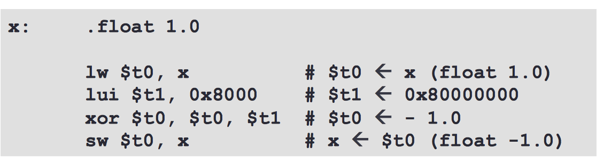

### Single to double precision (cvt.d.s) 
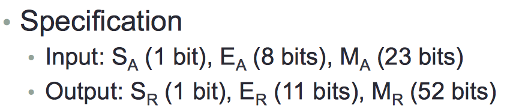
**Operation** 
+ Sign doesn't change: S<sub>R</sub> = S<sub>A</sub>
+ Exponent: change excess 127 into excess 1023: E<sub>R</sub> = E<sub>A</sub> + 896
+ Mantissa: add 52-23 = 29 zeros to the right: M<sub>R</sub> = M<sub>A</sub> || 00…0

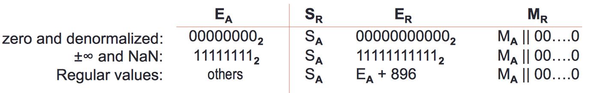
**Basic Operator (no handling of special values)**
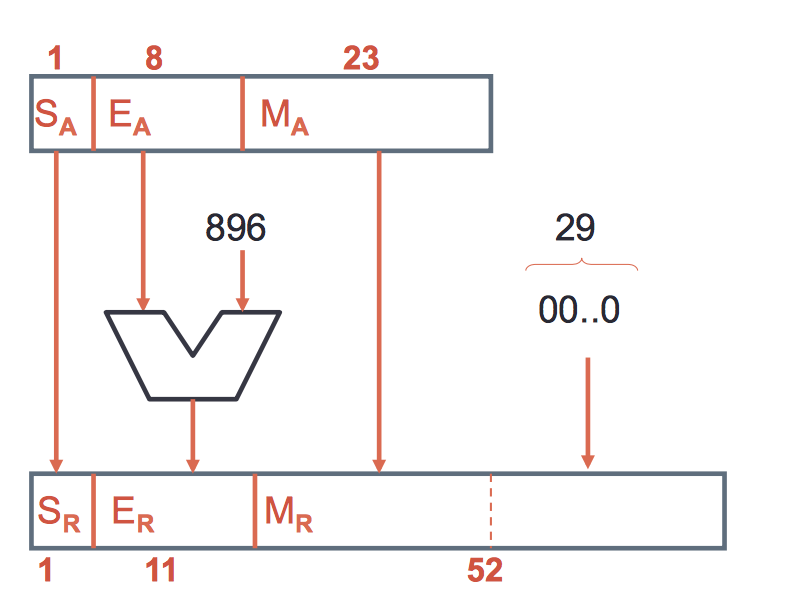
**Handling special values: obtaining the exponent** 
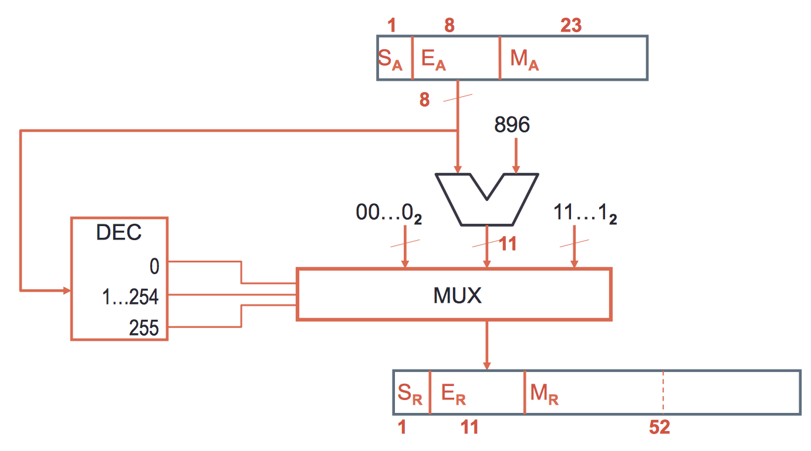 
> To make the DEC you need an NOR gate for E=0, an AND gate to obtain E=255 and an AND with the 2 inputs being the other gate's ouputs negated, so we obtain E=1..254

###  Double to single precision (cvt.s.d) 
**Structure** 
+ Sign: does not change
+ Exponent: Convert from 11-bit excess 1023 to 8-bit excess 127
    + `This conversion may have overflow`
+ Mantissa: remove 29 least significant bits, rounf the resulting M 

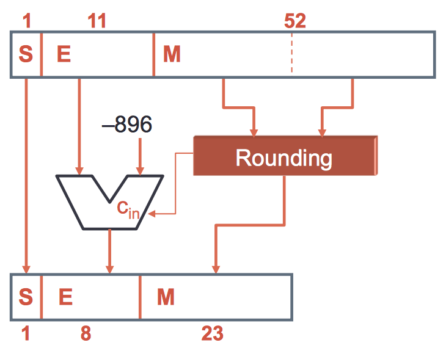

### Rounding details
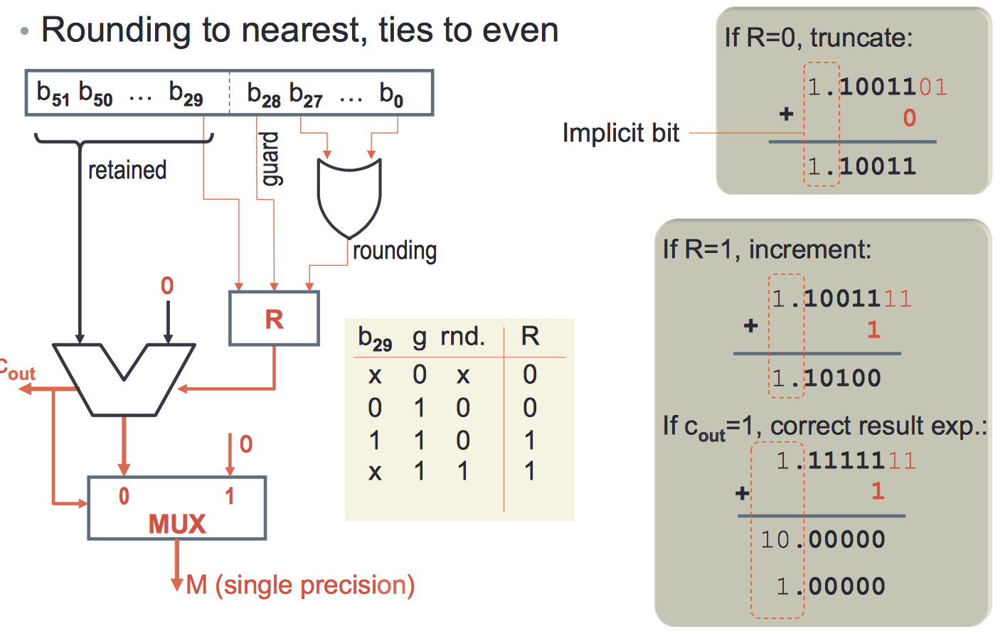
> The MUX is not needed ! 

 `R is the rounding circuit`

### Integer to double precision (cvt.d.w) 
**Operating principles** 
+ A postive integer W can be rewritten as +0.Wx2<sup>32</sup>
+ A negative integer W can be written as -0.(-W)x2<sup>32</sup>
+ The mantissa W has Z leading zeros (0 ≤ Z ≤ 32) 
    + Normalization requires a  left shift of Z+1 positions and substract Z+1 positions and substract Z+1 to the exponent

**Example:**
Transformation of integer to double precision
0100 = 4                          
0.0100 x 2<sup>4(nº bits)</sup>  -> `Z = 1 because the number of shifted positions is 1; (4 - Z - 1 + Excess) `
1.0000 x 2<sup>4-2(\*)</sup> = 1.0 x 2<sup>2</sup> = 4 `This process is called Normalization`
`(*) el numero de posiciones que tienes que mover para que 1 este a la izq. del punto `


**Specification**
+ Input: 32-bit integer (W) 
+ Output: S<sub>R</sub> (1 bit), E<sub>R</sub> (11 bits), M<sub>R</sub> (52 bits)
    + S<sub>R</sub> = Sign (W) 
    + M<sub>R</sub> = |W| << Z+1
    + E<sub>R</sub> = 1023 + 32 - Z - 1 = 1054 - Z
  
`Z is the number of leading 0 (numeros delante del primer 1)`
**Structure** 
+ Normalization counts the number of leading zeros Z
+ |W| is shifted Z+1 positions to the left
    + The exponent is then adjusted to 31 - Z
    + Adding the excess, E = 1023 + 31 - Z
+ The matissa is filled with zeros 

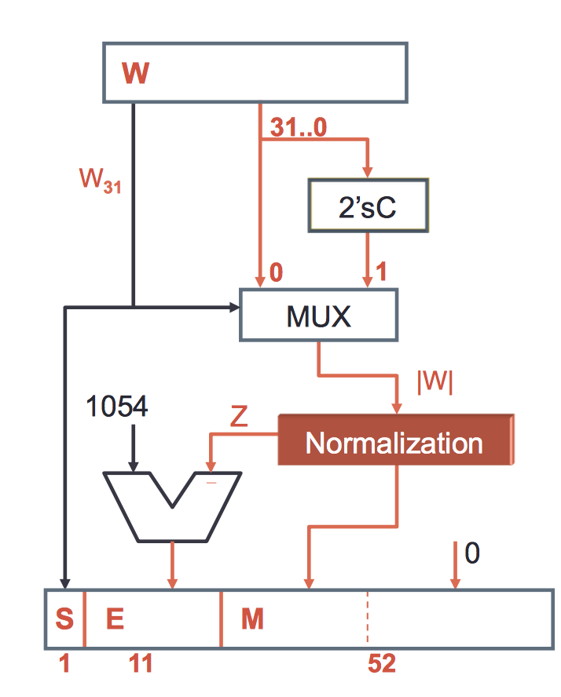
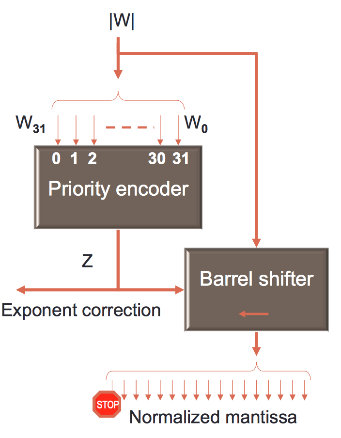
`STOP: AFter left shift by Z positions, the MSB is the implicit bit, which is no part of the mantissa`

+ A priority encoder codifies the position of the input's least-significant "1"
    + Hence we reverse |W|
+ A barrel shifter shifts Z positions to the left 
+ The implicit bit is descarded

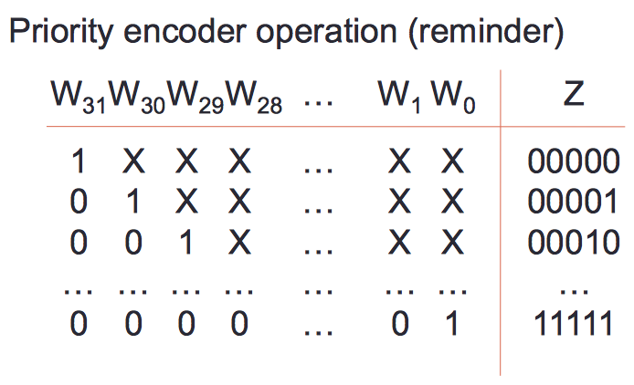

### Multiplication (mul.s and mul.d) 
**Specifications** 
+ Inputs: 
    + S<sub>A</sub> (1 bit) , E<sub>A</sub> (8/11 bits), M<sub>A</sub> (23/52 bits)
    + S<sub>B</sub> (1 bit) , E<sub>B</sub> (8/11 bits), M<sub>B</sub> (23/52 bits)
+ Output: S<sub>R</sub> (1 bit) , E<sub>R</sub> (8/11 bits), M<sub>R</sub> (23/52 bits)
+ Sign S<sub>R</sub> = S<sub>A</sub> **xor** S<sub>B</sub>
+ Exponent: add and compensate the excess
    + SP: E<sub>R</sub> = A<sub>A</sub> + E<sub>B</sub> - 127
    + SP: E<sub>R</sub> = A<sub>A</sub> + E<sub>B</sub> - 1023
+ Mantissa: 
    + Multiply 1.M<sub>A</sub> x 1.M<sub>B</sub> (consider implicit bit)
        + Size of the multiplier depens on precisio: 24 or 53 bit multiplier
    + The result needs to be renormalized (remove implicit bit) and rounded


> SPACE 
