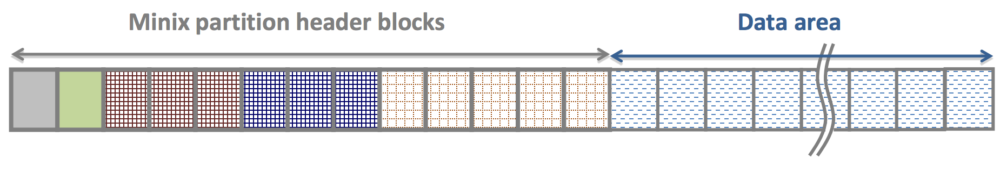
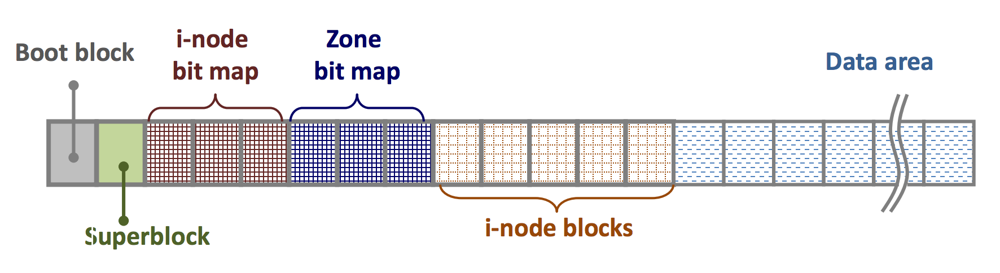
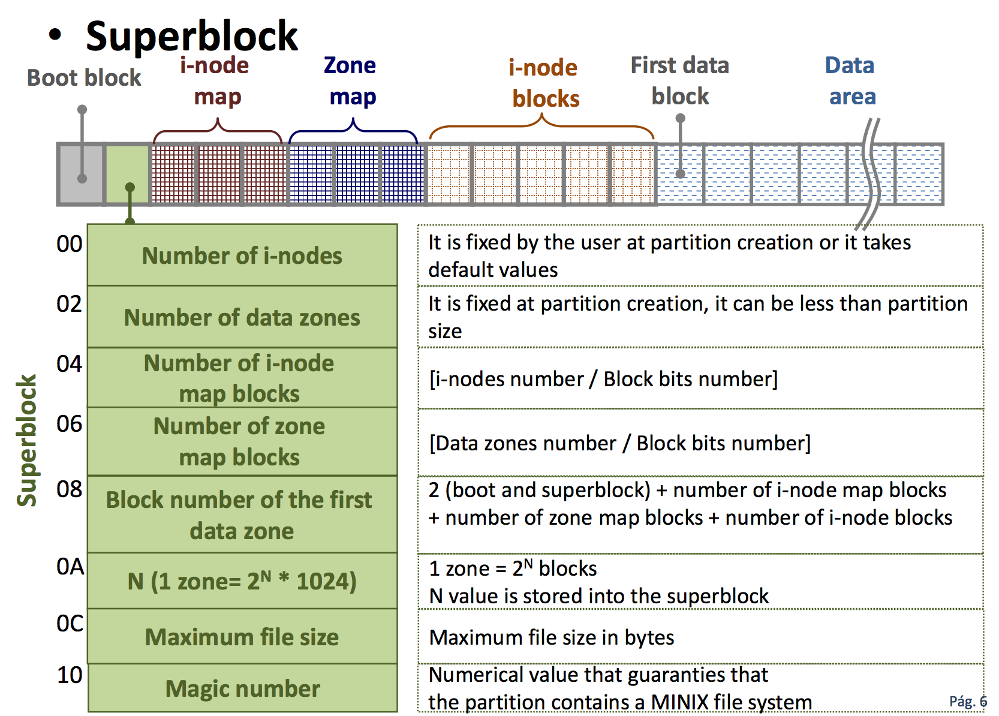
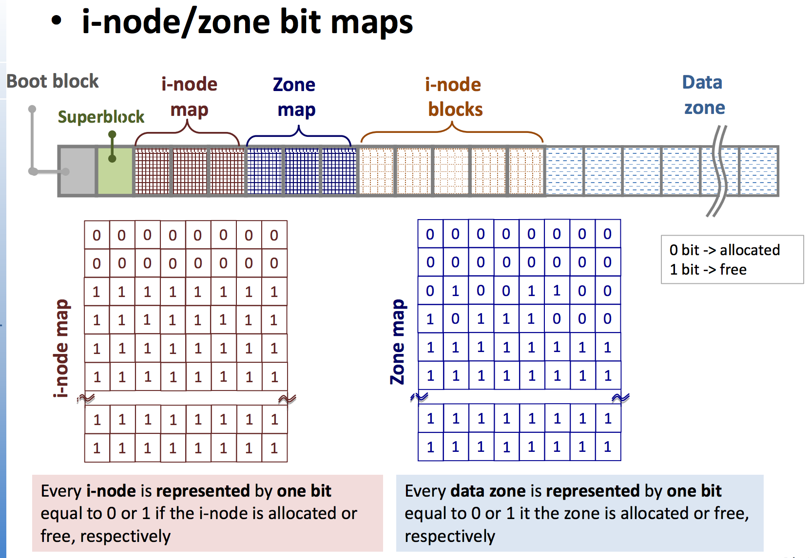
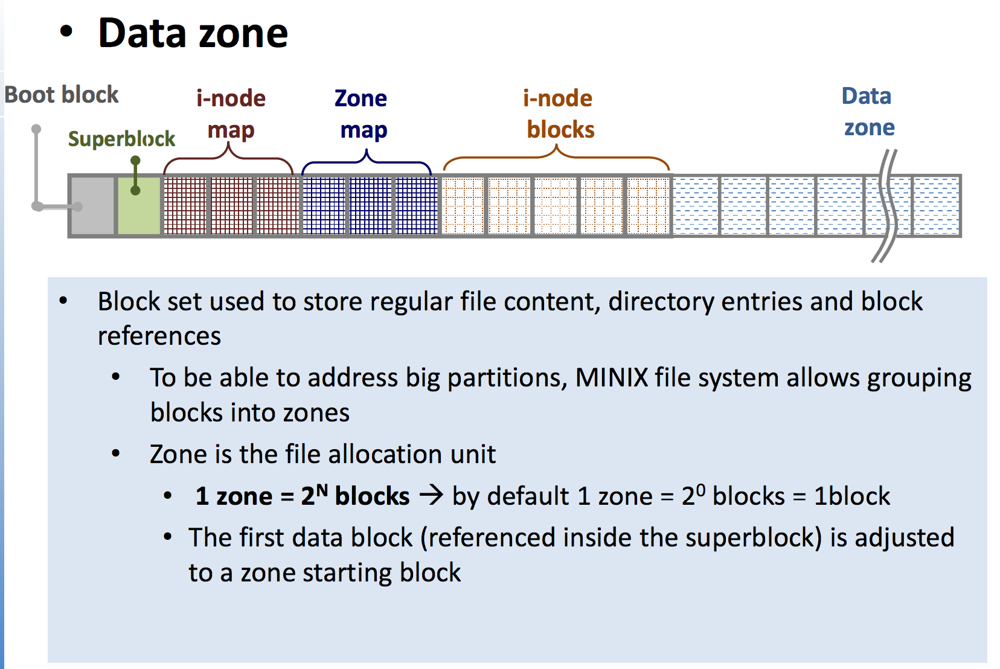
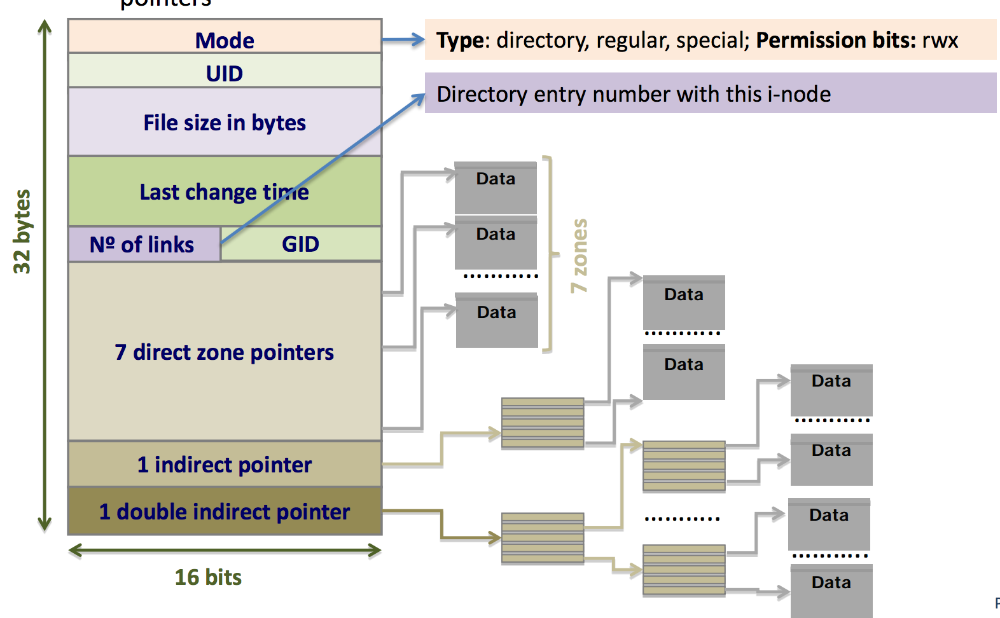
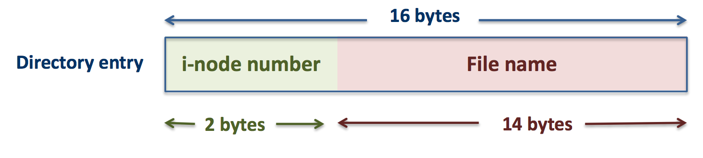
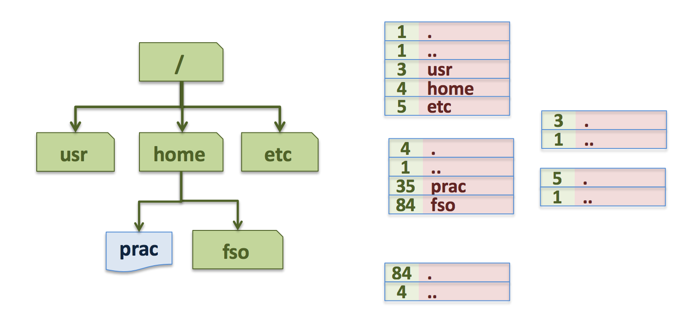

### Partition Structure
A **Minix partition** is built upon a set of fixed size blocks (i.e 1KBytes) 
A partition structure contains: 
+ A **header** made up of blocks groups intended to store the data structures that sustain the file system 
+ **Data area** made up of blocks intended to store file data 

### Header blocks 

+ **Boot block:** contains the boot program that loads the OS and transfers the control to it 
+ **Superblock:** is a data structure with the file system description that indicates the size and location of every element 
+ **i-node bit map:** bit vector to manage free and allocated i-nodes. It contains one bit per zone 
+ **Zone bit map:** bit vector to manage free and allocated zones. It contains one bit per zone. 
+ **i-node blocks:** contains the i-node data structures. The i-node number depends on the partition size (i-node 0 is not used) 

 

### i-node Structure 

Data structure that contains all the file attributes except its name
+ Every file has an associated i-node
+ It controls indexed allocation by means of direct, indirect and double indirect pointers 

**Performance analysis** 
+ *Efficient random access:** The maximum number of disk accesses is limited to 4
    + The indirect pointers are only used with big or very big files (commonly few) 
    + Small file (common case) access is very efficient
+ *Reliable and elegant design:* Every file has its own separated data structure

### Directory entry 

**Minix directories**
+ Directory structure as a directed acyclic graph (DAG) 
+ Directories are files which content is interpreted as registers -> directory entries (also named links) 

**Minix directory entry or link** 
+ It has a 16 byte size 
    + 2 bytes for the i-node
    + 14 bytes for the file name 
    

**Directory entry** 
+ When a directory is created, the entries '.' and '..' are automatically created
+ **i-node 1 describes the root directory** 
+ When a directory entry is removed it is marked with i-node 0

### Standard sizes 

Default sizes for Minix elements: 
+ 1 Zone = 20 blocks = 1024 bytes
+ 1 pointer to zone or block = 2 bytes = 16 bits
+ 1 directory entry = 16 bytes 
+ 1 i-node = 32 bytes 

> SPACE 
