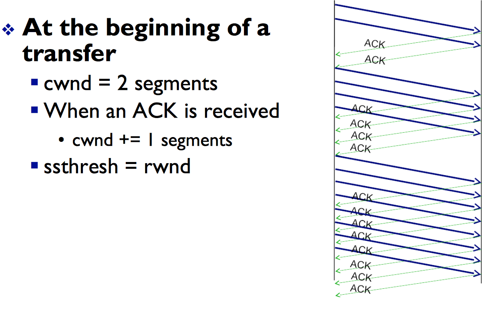
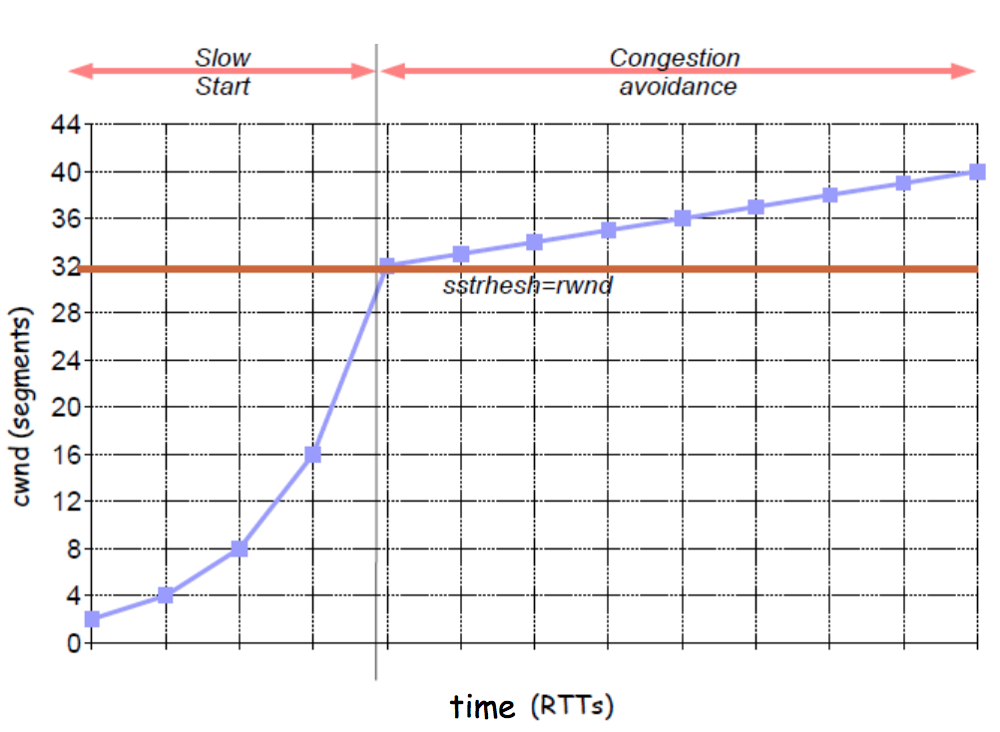
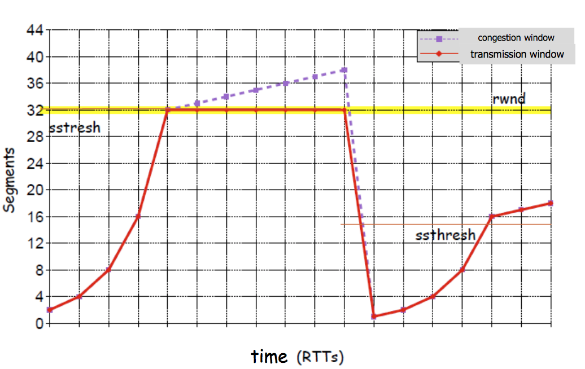

### Congestion 
+ Informally "too many sources sending too much data too fast for network to handle
+ Its different from flow control
+ Manifestations
    + Lost Packets (buffer overflow at routers)
    + Long delays (queueing in router buffers) 

### Goal of TCP Congestion Control
+ Congestion is bad for the overall performance in the network 
    + Excessive delays can be caused 
    + Retransmissions may result due to dropped packets (Waste of capacity and resources) 
    + In some cases (UDP) packet losses are not recovered
    + *Note:* Main reasonn for lost packets in the Internet is due to congestion -- errrors are rare
+ The Goal of TCP is to determine the available network capacity and prevent network overload
    + Depends on other conections that share the resources  

### TCP Congestion Control
TCP sender must use 2 algorithms to control the amount of outstanding data being injected into the network 
+ **Slow start algorithm** 
+ **Congestion avoidance algorithm**

To implement these algorithms, two variables are added to the TCP per-connection state
+ The congestion window (cwnd) 
    + It is a sende-side limit on the amount of data the sender can transmit into the network before receiving an ACK 
+ The slow start threshold (ssthresh) 
    + It is used to determine whether the slow start or congestion avoidance algorithm is used to control data transmission 
    + when **cwnd < ssthresh** 
        + The ***Slow start algorithm*** is used 
      + when **cwnd > ssthresh**
          + The ***Congestion avoidance*** algorithm is used  

The minimum of cwnd and rwnd governs datat transmission
+ transmission window (twnd) = minc (cwd, rwd) 
    + `Remember that the receive's advertised window (rwnd) is a receiver-side limit on the amount of outstanding data ` 

**Example:**
rwind -> win = 32 000 bytes
MSS = 1000 bytes  *(MSS is maximum segment size)* 
32000/1000 = 32 Segments -> rwnd 

### Slow Start Algorithm 
+ Beginning transmission into a network with unknown condition requires TCP to slowly probe the network to determine the available capacity, in order to avoid congesting the network with an inappropriately large burst of data ...
+ The **slow start** algorithm is **used**
    + At the beginning of a transfer **OR** 
    + After repaining loss detected by the retransmission timer  

### Congestion Avoidance Algorithm 
When the number of bytes acknowledged reaches cwnd, then cwnd can be incremented by up to 1 segment
   + `cwnd += 1/cwnd `

### Congestion Detection 
+ Packet loss is a sign of congestion 
+ Two indicators of congestion: 
    + A retransmission timer expires *(timeout)*
    + Three duplicate ACKs are received
+ What does TCP do then? 
    + ssthresh = max ( (twnd/2), 2) 
        + After repairing loss detected by the retransmission timer 
            + cwnd = 1 segment
            + slow start 
        + When 3 ACKs are received
            + cwnd = ssthresh
            + congestion avoidance 

> As we can see when cwnd < ssthresh we use the slow start 

> At the beginning the transition follows the congestion window, until it arrives to the change, where it will follow the rwnd. When a packet is lost a new ssthresh will be created. We can see that in this case this occurs due to a timeout 

### Fairness (more) 
**Fairnes and UDP** 
+ Mulimedia apps often do not use TCP 
    + do not want rate throttled by congestion control 
+ Instead use UDP: 
    + Send audio/video at constat rate, tolerate packet loss

**Fairness, parallel TCP connections**
+ Application can open multiple parallel conncetions between two hosts
+ web browsers do this

> SPACE 
