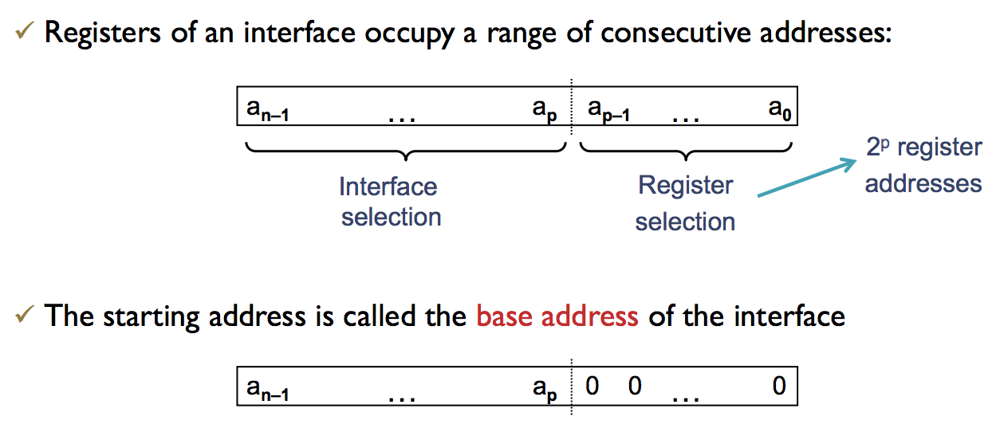
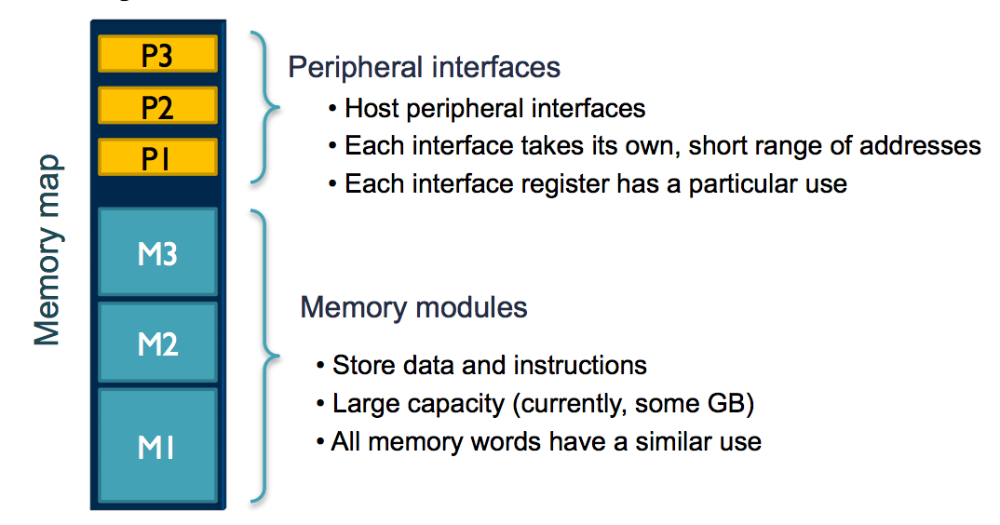
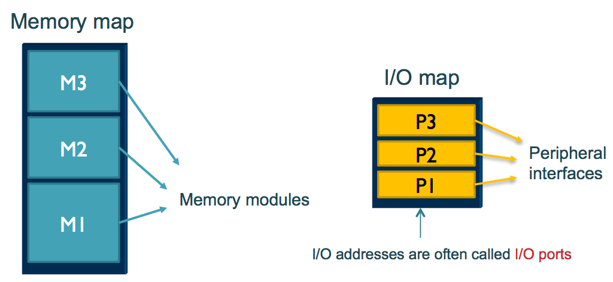

*The I/O system comunicates CPU and memory with the "external world"* 

### 1. The Big Picture 

**Peripheral Device:** 
+ A device that enables communication between computer and its environment 
+ Types: 
  + Human-machine interaction(MHI): keyboard, mouse...
  + Interaction with other devices: sensors
  + Storage: CD 
  + Communication: Bluetooth
+ Peripherals cannot be directly connected to the system bus. They need specific *adapters* (each peripheral needs its own adapter) 

**Adapter (I/O controller - I/O interface):** 
+ An electronic device that enables connecting the peripheral to the system bus 
+ Implements support for a programmer's view of the peripheral

The main functions of all I/O adapters are: 
+ Connect with the CPU 
+ Connect with the peripheral 
+ Control and timing of operations 
+ Data transfer
+ Error control 

### 2. The Concept of I/O interface

+ An I/O interface is (heterogeneous) set of registers that enable communication between programs and a given peripheral 
+ Every periphera has its own interface
+ Every register in the interface has its own address in the address space 
+ Each interface register can be read and writteh in their address space
+ Each interface register has its own different function

**Interface registers** 
+ Sizes: (8, 16, 32) 
+ Access Mode: (read-only, read/write...) 
+ Contents: 
  + A register may or may not be structured. When structured, each bit or group of bits has its own meaning, independent from the rest 
  + Some bits may be undefined
+ Types: 
  + Command: They trigger peripheral actions 
  + Status: Provide current information about the peripheral 
  + Data: Enable transmission/reception of date to/from the peripheral 
  
Interface registers have their own addresses in one of two possible I/O addressing schemes: 
+ *Memory-mapped I/O* => Most processors, including MIPS
+ *I/O-mapped I/O* => Intel 

**Interface addressing schemes**
*Memory-mapped I/O:* 
+ There's a unique, shared address space for both memory and I/O devices (MIPS model) 
+ Register access via Load and Store instructions

*Input/Output-Mapped I/O* 
+ Separate addressing spaces for memory and I/O (Intel model) 
+ Load/Store used only for memory access
+ Specialized Input/Output instructions for accessing peripheral interfaces

### 3. Internal organization of I/O interfaces 

**Selecting the interfaces** 
Implementation of selection on a unique shared map (memory-mapped I/O) 

