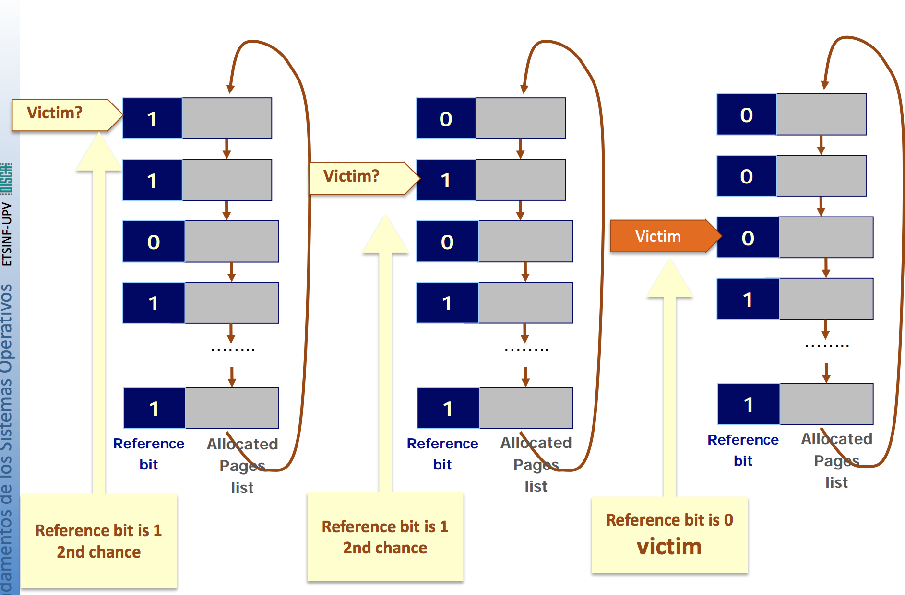
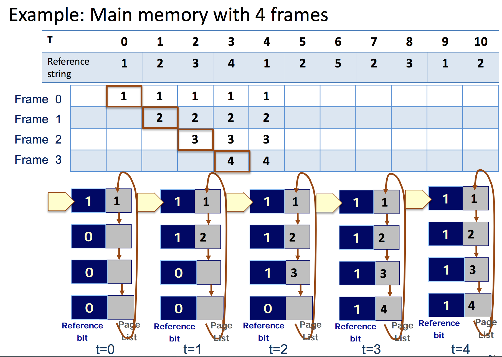
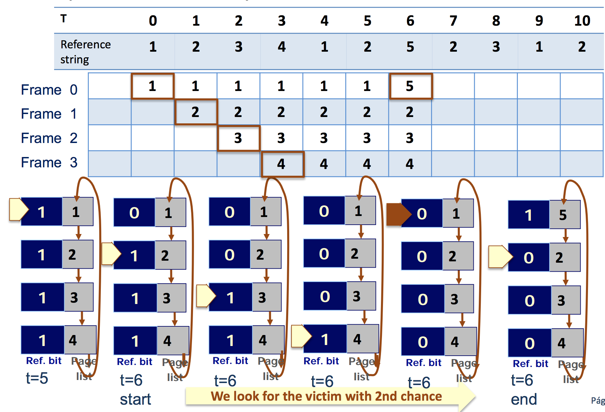
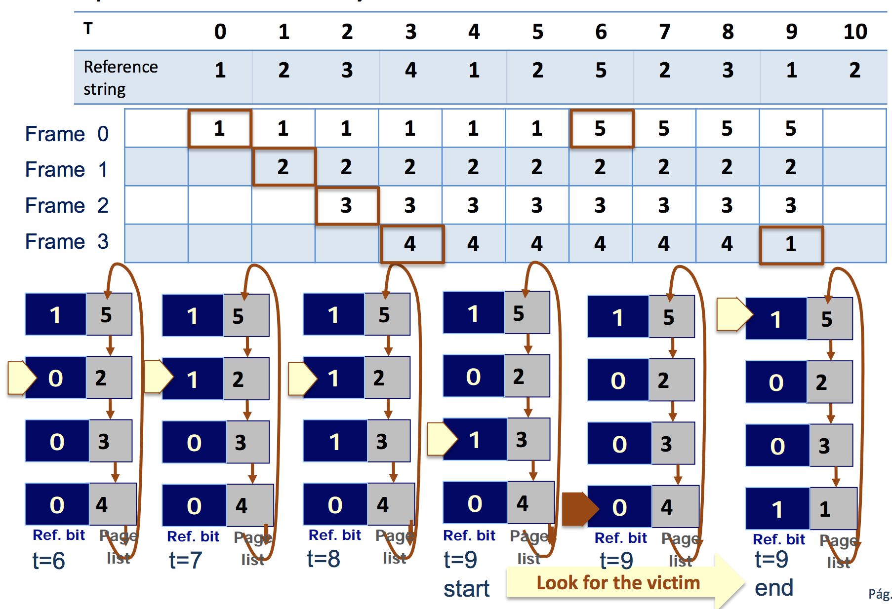
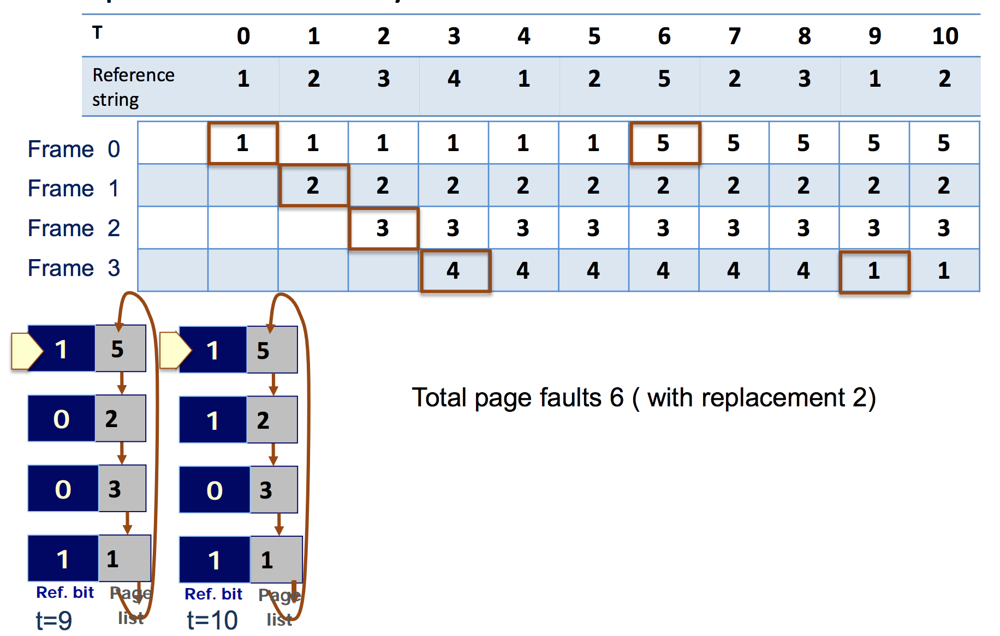
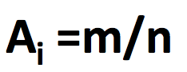
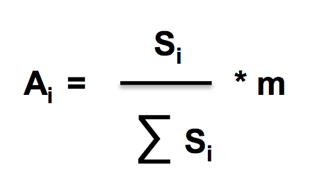
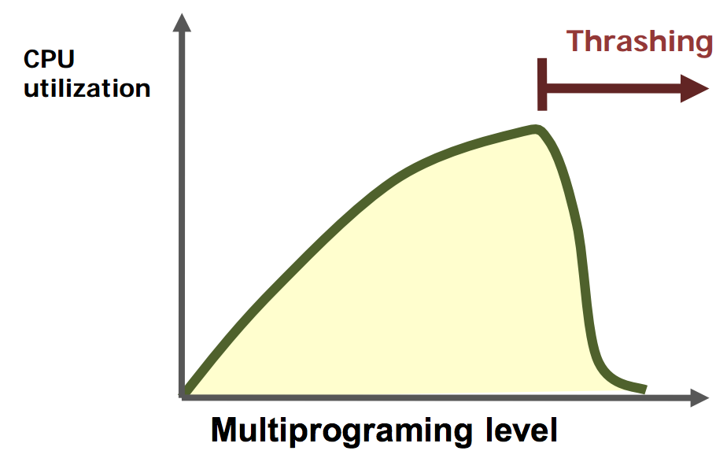
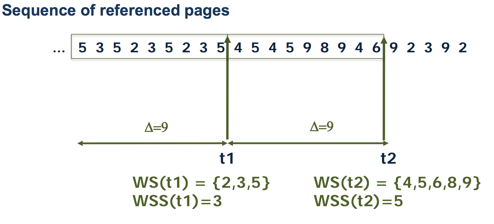
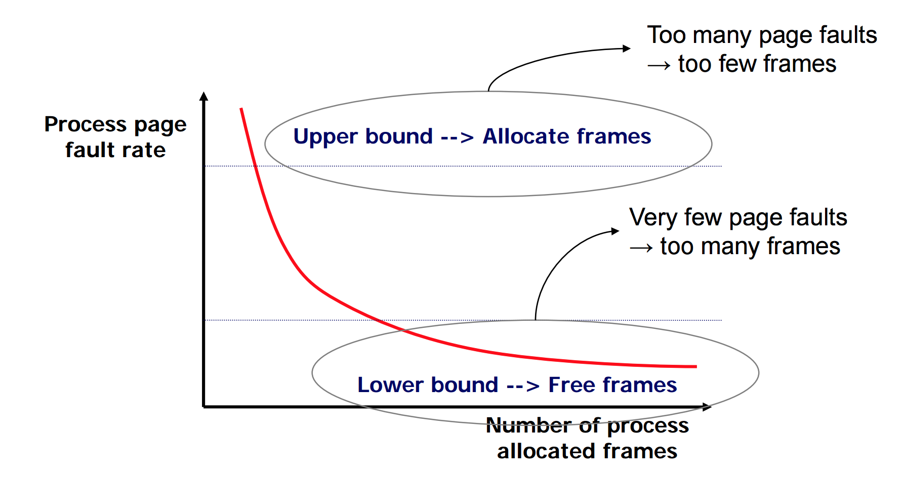

### Second chance replacement algorithm 
Supporting LRU as a replacement algorithm is too expensive
**SOLTUTION:** To approximate LRU using the reference bit 

**2nd chance algorithm**
+ It reviews the page reference bit on FIFO ordering
+ If the page reference bit is 1
    + Put reference bit to 0 
    + Let page in memory 
+ If the page reference bit is 0 
    + The page is chosen as victim 
    + Next page is the first candidate for next victim 

### Example: Main memory with 4 frames: 

### Frame allocation 
Frame allocation problem 
+ Free frame list: 
    + Frame management requires a data structure whre free frames are kept
+ Frame to process delivery policy and the OS
    + The OS gets the required number of frames to execute itself
    + Processes receive the minimum initial number of frames and the remaining ones on demand
    + The minimum number of initially assigned frames depends on the indirection leve in the CPU instruction set => To execute an instruction all its operands must be allocated in main memory 
+ Frame delivery policies given m frames and n processes
    + Fair allocation: All processes allocate A*i* frames equally 

    + Proportional allocation: A process P*i* with size S*i* allocate A*i* frams computes as: 

    + Priority allocation: higher priority processes allocate more frames

**Replacement policy scope**
+ Local replacement: only pages allocated to the process that generate the page fault can be replaced
    + It cannot choose a victim from another process
    + The number of process allocated frames does not change
    + A process execution is not affected by the remaining processes
        + Advantage:    Sensible response time
        + Disadvantage: Worse global memory management
+ Global replacement: the victim is chosen betwenn all allocated pages in main memory 
    + The victim can belong to another process
    + The number of porcess allocated frames can change
        + Disadvantage: Response time sensitive to system load
        + Advantage: Better global memory management

### Thrashing 
**The trashing problem:**
+ Memory becomes scarce and processes generate a lot of page faults => I/O time becomes dominant
+ The OS allows more processes entering for execution regarding the low level of CPU use
+ This makes things worse because the same amount of memory has to be shared with more and more processes => Page fault rate keeps increasing 

**How to solve thrashing?** 
+ To anticipate an to prevent the problem
    + Using a working set model 
    + Controlling page fault rate
+ Once thrashing is detected
    + Swap out processes with a medium term scheduler

**Reference locality principle** 
+ Instruction and data processed recently (and the ones close to them) have a high probability of being processed in the near future
+ Locality: 
    + Set of pages that a process uses as a whole
    + It is hard to identify
+ Thrashing happens when 
    + **Locality size > total main memory size** 

**Working set model: preventive technique**
+ It assumes reference locality principle 
+ Obtain the number of pages that a process needs to have simultaneously in memory to avoid thrashing
+ Working Set (WS):
    + Set of pages accessed in a process last referenced logical addresses
    + Working set window: 
        + Fixed consecutive number of reference ∆ used to compute WS
        + WS is made of the set of pages accessed in the last ∆ references
    + Working set size (WSS): Number of different pages that belong to the WS
    + In a system with m frames and n processes P*1*…P*m* there is trashing when 

##Example of WS model 
+ WS window ∆ = 9
+ Compute WS and WSS in t1 and t2

> WS = set of numbers that appear between ∆ , WWS = number of numbers in the WS obtained 

**Page fault rate control** 
+ Preventive technique that analyses directly the page fault rate to guess if thrashing is near to happen 

### Frame reservation
+ Concept: 
    + Modern OS kepp a precentage of main memory as a store of free frames (reservation frames)
+ Goals: 
    + To reduce the time taken to serve a page fault
        + Attempt to have free frams available 
        + The replacement algorith is used
            + Only when the free frame level gets too low
            + To look for victims to amortize its use
        + Page out
            + Several pages are written at once to disk 
    + **To avoid Thrashing**

**Reservation frame management**
+ The OS guarantess that there will be always a set of free frames
+ Some thresholds are set: 
    + Minimum number of free frames (Mmin)
    + Recommended number of free frames (Mrec)
    + Mrec >> Mmin 
+ Very efficient replacement algorithms are NOT required
    + The first VMS (virtual memory system) systems used FIFO because their MMU did not have reference bit
    + It is common to use a 2nd chance algorithm 

**Monitor Process** 
There is an internal process that periodically accounts for the number of free frames (frame-free): 
+ if **frame-free > Mrec** then do nothing
+ if **frame-free < Mmin** then: 
    + Swap out some processes until reaching REC free frames
    + Victims are process that spend more time suspended
+ if **Mmin ≤ frame-free ≤ Mrec then: 
    + Seek for processes with too many frames (very low frame rate) to "steal" them some frames applying a replacement algorithm 
    + Several victims are selected in every process, the actual number differs on every OS

**Frame reservation management in thrashing**
+ When thrashing happens the number of free frames decreases quickly
+ The process monitor detects it when: 
    + Between two monitor activation frame-free decreases too much
+ Solutions: 
    + Swap ot whole processes until reaching frame-free = Mrec
    + Free a constant number of frames in every monitor activation if frame-free < Mrec (the monitor activation frequency increases) 

**Reservation frames content** 
The frame of a victim selected by the OS is not allocated immediately to another page, instead the frame goes to the reserve stock 
+ If victim pages are referenced again soon by the process: 
    + There is a high probability that they be in the reserve stock and then they can be relocated without having to read them on disk 
    + The OS remembers which is the content of every frame in the reserve stock
+ If frames included in the reserve stock correspond to modified pages: 
    + They are not considered to solve page faults immediatelt because its content has to be written on disk (into a file or paging area) 
        + When a threshold is reached all these pages are written at once
        + Page out overhead is amortized => the number of global page writing is minimized
    + After write their frames become free and can serve page faults  

> SPACE 
