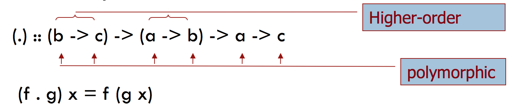
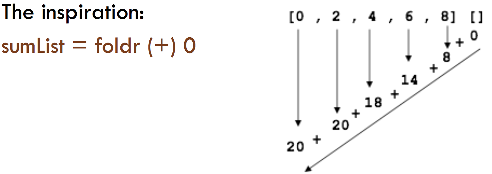
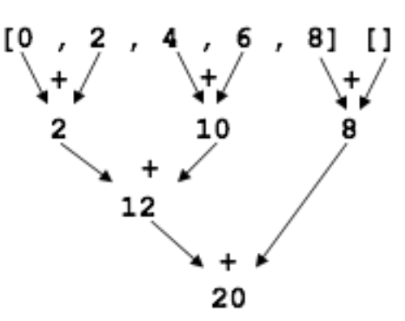
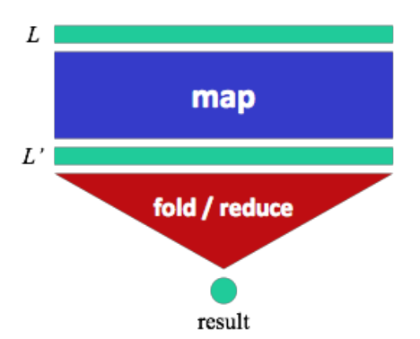
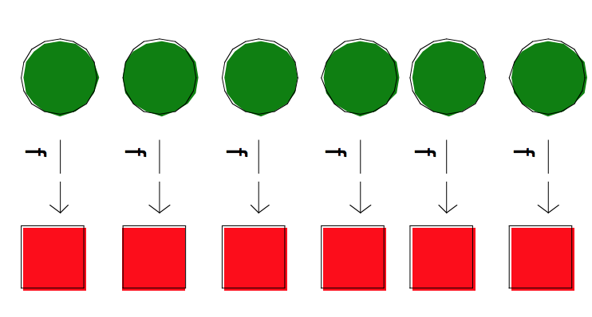
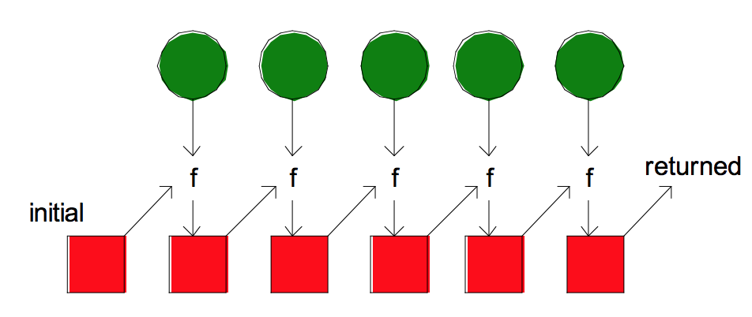

### Anonymous (or nameless) functions
+ In Haskell we can define anonymous functions of the form \x -> e
    + Example: The funtion square x = x\*x can be defined in this way as follows: square = (\x -> x*x) 
+ In general, `\x1 x2 .. xn -> e is equivalent to \x1 -> (\x2 -> (... -> (\xn -> e) ... )) `
    + Example: 
    + `sumOfSquares = \x y -> x\*x + y*y` *is equivalent to:* `sumOfSquares = \x -> (\y -> x\*x + y*y )`

### Function Composition 


+ Funtion composition is defined in the Haskell prelude as follows: 
    + `(f.g) =\ x -> f(g x) `
+ The function composition is a frequent computation pattern. The solution of a problem consists of serveral steps each of which can be indepently addressed by using independent funtions that can be then *composed* to solve the problem 
    + Example: `twice f x = (f.f)x` > Point-wise
    + Equivalently, `twice f = f.f` > Point-free
    + In lambda notation: `twice =\f x -> f (f x) `

### Iterators and compressors
#### Iterators 
+ Iterators can be used to save memory and time when dealing with *iterable types* like lists or sequences
+ *iterate f x* returns an inifinite list of repeated applications of f to x: iterate f x is [x, f x, f (f x), ...]

```haskell
iterate     :: (a -> a) -> a -> [a]
iterate f x = x : iterate f (f x) 

-- Bonus: The Haskell prelude function from is defined by 
from = iterate (1+) 
```
#### Compressors
+ Many functions over lists follow a recursive scheme 
    + f :: [a] -> [b]
    + f [ ] = z 
    + f (x:xs) = x ⊗ f xs

```haskell
sum :: [Int] -> Int 
sum [] = 0
sum (x:xs) = x + sum xs 
```

+ We can introduce a function "foldr" that implements this kind of transformation: 

```haskell
foldr :: (a -> b -> b) -> b -> [a] -> b
foldr op z [] = z 
foldr op z (x:xs) = x `op` (foldr `op` z xs) 
```
+ The previously considered function f can be just define as follows `f = foldr (⊗) z `
+ And similarly for specific functions like: 
    + sum     = foldr (+) 0 
    + product = foldr (*) 1 
+ Example: the function *sum* given in a previous example (length of a path) can be given by using foldr or foldl 

```haskell
sum :: [Float] -> Float
sum = foldr (+) 0.0 
```
### The MapReduce Scheme 
+ The combined use of optimized functions like map and fold inspired *an efficient syle of sequence processing*, the MapReduce scheme, which has been successfully used in massive dataprocessing, with thousands of processors and around 100000 HDs
+ The funtiona scheme MapReduce was promoted by Google and has a number of relevant applications: 
    + Information retrieval 
    + Cloud computing

### Use of MapReduce
+ Google: 
    + Building indices for Google Search 
    + Classifying notice for Google News
    + Automatic translation 
+ Yahoo!:
    + Yahoo! Search
    + Spam detection in Yahoo! mail
+ Facebook: 
    + Data mining
    + Optimization of publicity 
    + Spam detection 
    


+ The computation proceeds from left to right; the number of steps is equal to the length of the list. 
+ But (+) is associative and commutative, which means we can (automatically) parallelize the process and distribute the workload over hundreds/thousands processors! 
+ The cost becomes O(log n) if we proceed as follows: 


+ We can do it by appropriately combining map and fold:



+ map f : builds a new list by applying f to the input list `Exploit commutativity`


+ fold f z xs : applies f to the elements of a list and carries an *accumulator* `Exploit associativity`
    + The function f returns the new value of the accumulator, which is combined with the next element of the list  



+ The MapReduce scheme is a useful abstraction that simplifies and optimizes heavy computations 
+ MapReduce has inspired the design of libraries for other languages: 
    + C ++ and Java MapReduce libraries 
    + Advantages: we can focus on the problem, and leave the management details (organization, keys, acces, etc.) to the library


> SPACE 
