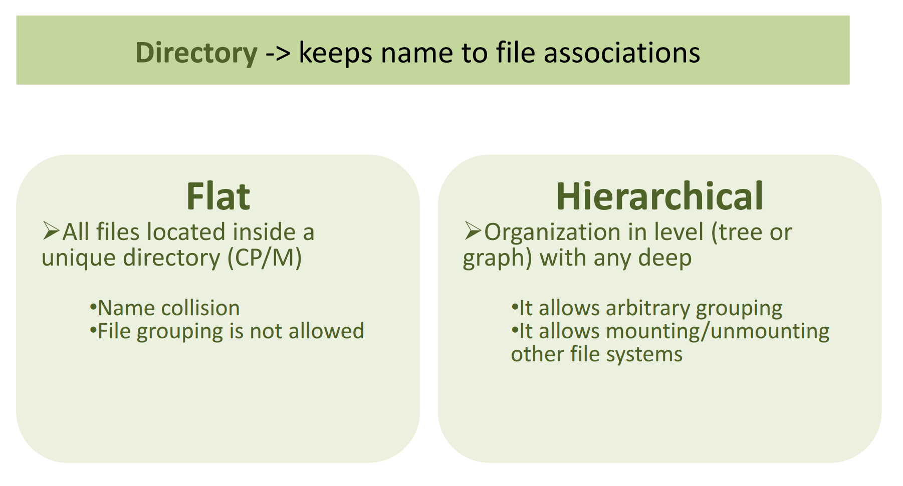
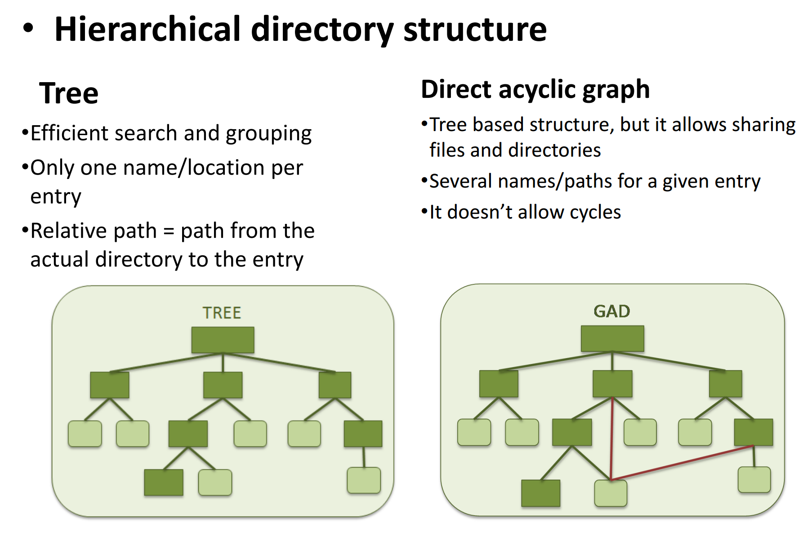
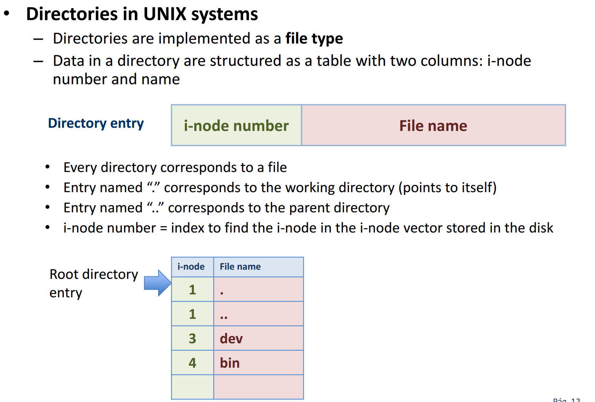
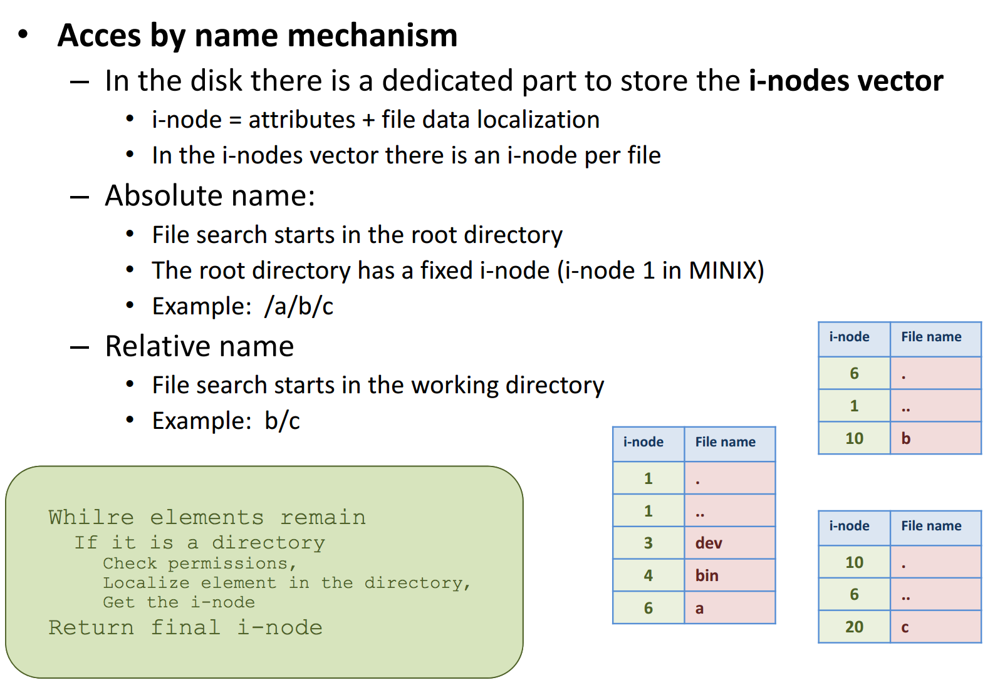
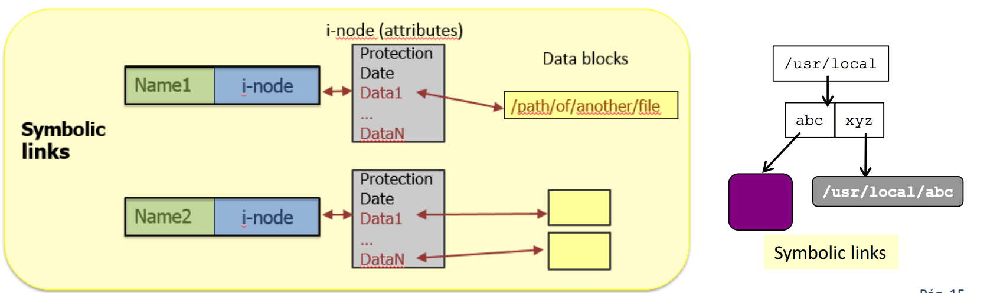
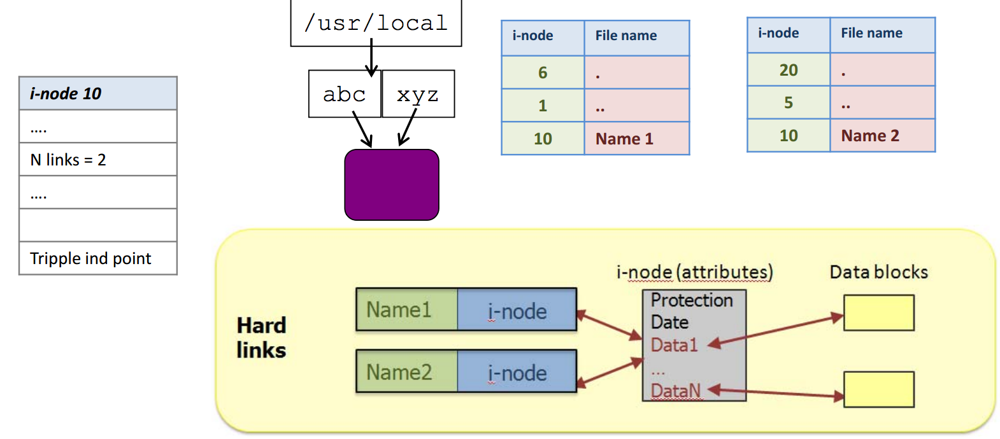
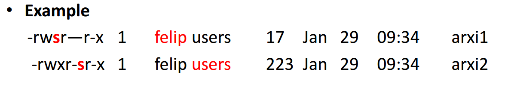
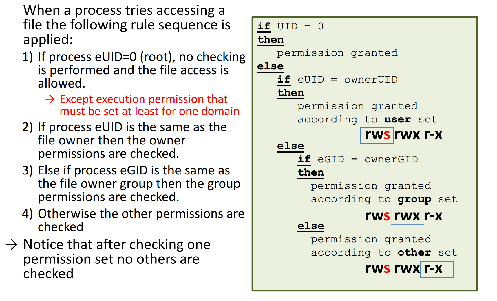
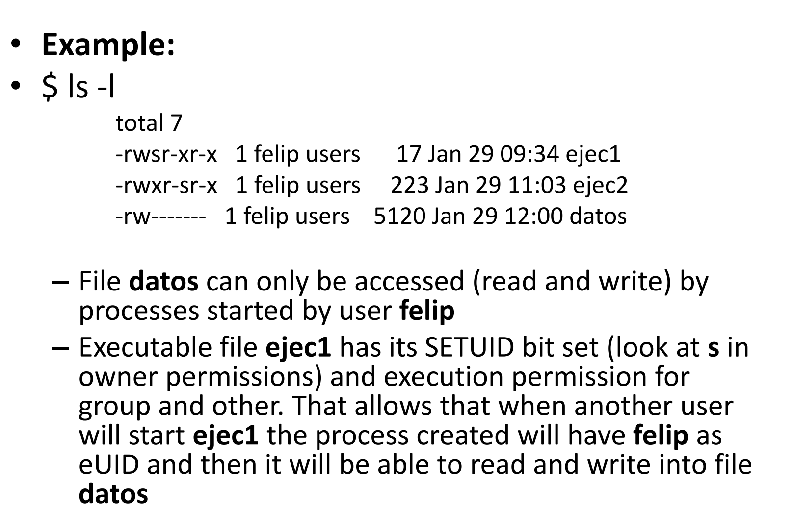

### Directory concept 

**A directory is a file** 
+ An abstract data file: contains directories entries
+ It is the required element to organize files 

**Goals** 
+ To find quickly a file from its associated name 
+ To implement a convenient name scheme for users 
+ To allow users to organize their files freely 
+ To allow owners controlling operations permitted to other users on their files and directories 

**Operations on directories:** 
+ Create entry (file or directory): It requires available space
+ Remove entry: It frees the disk space allocated to the entry and remove the corresponding directory entry 
+ Search by name: It is performed sequentially 
+ List directory content: It allows to see the directory entries inside the directory 
+ Rename entry: It changes the name field in a directory entry 
+ Navigate the file system: It allows accessing any point inside the directory hierarchy

### Directory implementation 

**Directory content** 
+ It is organized as registers named **directory entries** 
+ It has a directory entry per element (file or directory) inside the directory 

**Directory entry** (Its format depends on the file system)
+ UNIX: Name + i-node reference
+ Windows: Name + attributes + reference to data 

**Directory location** (in disk) 
+ Centralized in a disk dedicated area (flat) 
+ In files (hierarchical) 

**Directories in FAT(12,16)**
+ Root directory of fixed size and located in a dedicated area 
+ All the other directories are managed as files containing directory entries
+ A directory entry has 32 byte size 
    + Name (8) + extension (3) 
    + Attributes (i.e. date, time, size, etc.) 
    + First data block index (FAT entry) 

### Links 
**Symbolic Links** 
+ UNIX terminology (Windows 7 also supports them by means of **mklink** command) 
+ A is a symbolic link file that links with file B 
    + One A's attribute indicates that it is a link 
    + The OS interprets A data as a path to access file B
    + The OS redirects read and write operations on A to B 
    + The access permissions that apply are the ones from B 
+ B can be located in another file system form A (i.e remotely mounted) 
+ What happensif file B is deleted or moved to another location? 
    + In some systems (i.e MacOS) the OS itself corrects the link path 
    + In other systems (i.e Linux) the link becomes orphan and no longer works 
+ Deleting A does't affect B 

**Hard links** 
+ Two or more directory entries contain the same i-node number
    + A file can be accessed from several paths (names) 
+ Every i-node keeps a counter with the number of directory entry that reference to it 
    + The file (data + i-node) is deleted only when its last reference is deleted
+ Hard links must be inside the same file system 

### Free disk space management 
Disk space is seen as a **blocks vector** 
At every moment the OS has to be able to know which ones are free 
+ Any block doesn't work 
    + Contiguity is required for efficiency sake
+ **Bit map**
    + The state for every block is represented by one bit (i.e. value means free) 
    + It is stored in a dedicated disk area 
    + It allows efficient searching of consecutive blocks 
+ **Linked list**
    + In a specific disk location it is mantained the index to the first free block 
    + Every flee block point to the next 
+ **Grouping** 
    + Free blocks are represented by means of a index block list 
    + IT easies inserting/extracting blocks, but it is difficult to look for contiguity 

 identifier of the process creator user
    + Effective UID (eUID) indentifier of the process executable file owner 
+ Group identifier:
    + Real UID (rGID) identifier of the rUID user group 
    + Effective (eGID) identifier of the eUID user group 

**File protection attributes** 
+ Permission bits: 9 permission bits organized in three sets: owner, group and others
+ Sample formats: rwxr\_xr, 0755, 04755, rwsr\_xr_x
+ Interpretation: 
    + *Regular files:* read, write and execution 
    + *Directories:* list content (r), create or remove entries (w), move to subdirectories (x)
    + *Special:* read and write
+ SETUID and SETGID bits 

**Attributes assignmen** 
+ A file receives its attributes from the process that creates it 
    + `ownerUID = UID` & `ownerGID = GID` 
+ The process receives its attributes thanks to the inheritance mechanism and the information stored in /etc/passwd
    + `Name: password: UID: GID: description: HOME: shell`
+ A process can change its UID and GID when calling to exec() on a file with SETUID or SETGID set
    + If the executable file has its SETUID bit set then the eUID becomes the file "ownerUID" 
    + If the executable file has its SETGID bit set then the eGID becomes the file "ownerGID" 

###UNIX protection rules

> SPACE 
