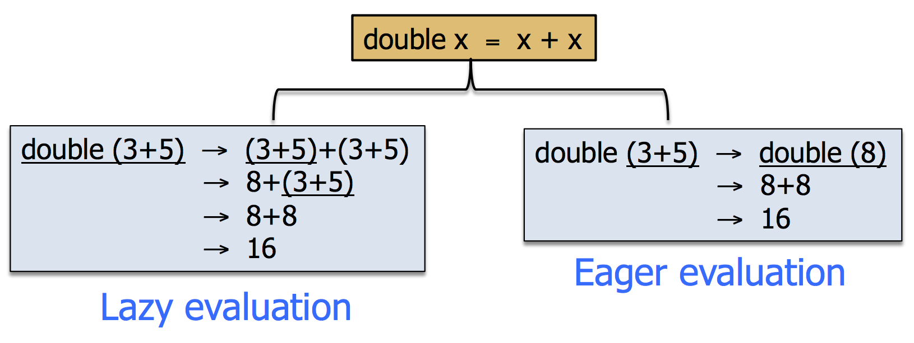
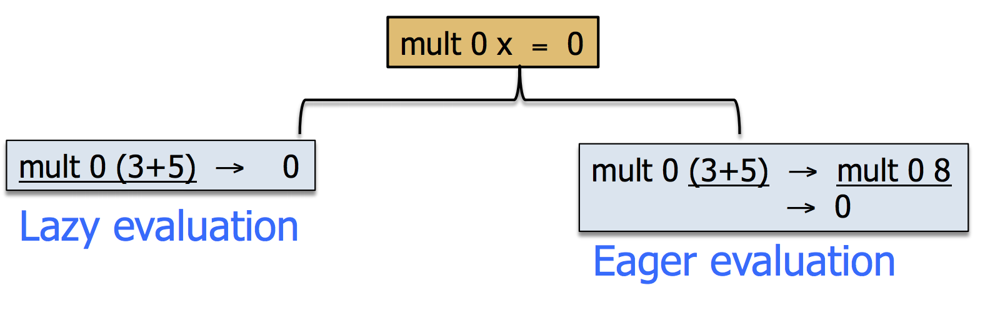
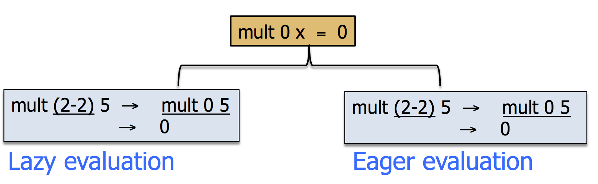

### Operational Model 
+ A **functional program** consists of: 
    + A list of equations defining functions (possibly with additional equations defining types) 
    + An initial expression (without free variables) 
+ The **execution** of a functional program consits of the evaluation of the initial expression 
+ The evaluation itselft consists of a sequence of reduction steps 

We use the notation of *substitution* to formalize the parameter passing as a matching from the expression to be evaluated against the *(left hand side of)* equation l = r which is used in the reduction step.
+ A substitution σ is a mapping from variables into expressions such that σ(x) ≠ x holds for a finite set of variables
+ Substitutions are then represented by just giving the non-trivial bindings {x<sub>1</sub> -> t<sub>1</sub>, ..., x<sub>n</sub> -> t<sub>n</sub> with x<sub>1</sub> ≠ t<sub>1</sub>. 
    + `Example: σ = {x -> 1, y -> 0} is a substitution 
+ The *identity* or "empty" substitution is denoted by ε	
+ The application σ(e) of a substitution σ to an expression e is called ***instantiation*** 

```haskell
-- EXAMPLE 1 
σ    = {x -> 1, y -> 0}
e    = f( x,g(y) ) 
σ(e) = g(1, g(0) ) 

-- EXAMPLE 2
σ = {x -> s(y), y -> 0}
e = f(x,y) 
σ(e) = f( x(y),0 )        -- note that the y in s(y) is not substituted by 0  
```
### Reduction 
A **redex** is an instance σ(l) of a left-hand side l of an equation l = r *(or l | c = r for conditional equations)*
+ The expression e *reduces* to e' if: 
    + It contains a redex σ(l) of an equation l | c = r 
    + The condition c holds (i.e, it reduces to True) after applying σ to it
    + e' is obtained as the replacement of σ(l) by σ(r) in e 
+ Expressions that cannot be further reduced are called **normal forms** 

```haskell
-- EXAMPLE 

sixtimes 1 -> double ( triple 1 )         -- 1. we apply first, redex to sixtimes 1 => we obtain that the eq: sixtimes x = 
                                          --    double ( triple x ) and the subs is {x -> 1}
           -> double ( 3*1 )              -- 2. apply redex to triple 1 => eq: triple y = 3*y and the subs {y -> 1}
           -> double 3                    -- 3. apply redex to 3*1 we obtain 3 (predefined funtion: product) 
           -> 3 + 3                       -- 4. apply redex to double => eq: double x = x+x and subs {x -> 3}
           -> 6                           -- 5. apply redex to 3+3 we obtain 6 (predefined function addition) 
```
`6 is the Normal form`

### Evaluation 
**The evaluation of an expression proceeds by applying successive reduction steps until a normal form is reached. The final result may depend on the selected *reduction strategy***

### Evaluation modes 
Given a funtiona call: 
+ ƒ e<sub>1</sub> ... e<sub>k</sub>

We can distinguish two essential evaluation modes: 
+ Eager evaluation 
+ Lazy evaluation 

#### Eager Evaluation 
Eager evaluation *(call-by-value)*: first evaluate the arguments; then use an equation defining the funtion ƒ 

```haskell
-- EXAMPLE EAGER
sixtimes 1 -> double (triple 1) 
           -> double (3*1)
           -> double 3
           -> 3 + 3
           -> 6
```
#### Lazy Evaluation 

Lazy evaluation *(call-by-name)*: the arguments are evaluated only if this is necessary to apply some of the equations defining ƒ

```haskell
-- EXAMPLE LAZY 
sixtimes 1 -> double (triple 1) 
           -> (triple 1) + (triple 1) 
           -> (3*1) + (triple 1) 
           -> 3 + (3*1) 
           -> 3 + 3
           -> 6 
```
#### Which strategy is more efficient? 
`It depends on the program!`
+ **Sometimes Eager is more efficient than lazy**

+ **Sometimes Lazy is more efficient than Eager**

+ **Sometimes Lazy and Eager are equally efficient**


### The Evaluation Process 
*The evaluation process can be:* 
+ Successful: it terminates and yields a value
    + `sixtime 1 -> *6` *(the star means to skip the procedure)*
+ Failed: it terminates but no value is obtained
    + `tail (x:xs) = xs => the expression tail[] is a normal from but it is not a value`
+ Incompleted: it does not terminate 
    + `for loop = loop and mult 0 x = 0 => An incomplete evaluation sequence: mult 0 loop -> mult 0 loop -> ... `

#### Lazy Evaluation 
With lazy evaluation we can avoid ***nontermination***
+ `loop = loop `
+ `mult 0 x = 0`
+ `mult 0 loop -> 0`
> We can see that when we detect a 0 with lazy evaluation, 0 is always obtained with no need to evaluate the whole function 

With lazy evaluation we can deal with ***infinite data structures*** 

```haskell
-- EXAMPLE 
from n       = n:from (n+1) 
sel 0 (x:xs) = x 
sel n (x:xs) = sel (n-1) xs           -- We can see that the expression "from 0" denotes an infinite list containg all                                         -- natural numbers

-- With lazy evaluation we can evaluate expressions involving infinite values

sel 1 (from 0) -> sel 1 (0:from(0+1)) 
               -> sel (1-1) (from (0+1)) 
               -> sel 0 (from (0+1))
               -> sel 0 ((0+1):from(0+1+1))
               -> 0 + 1
               -> 1 
```


> SPACE 
