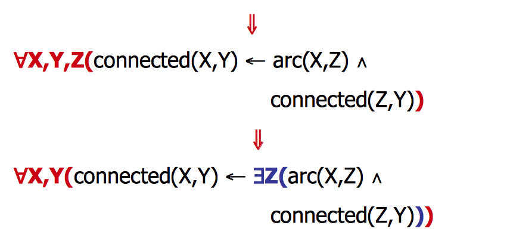
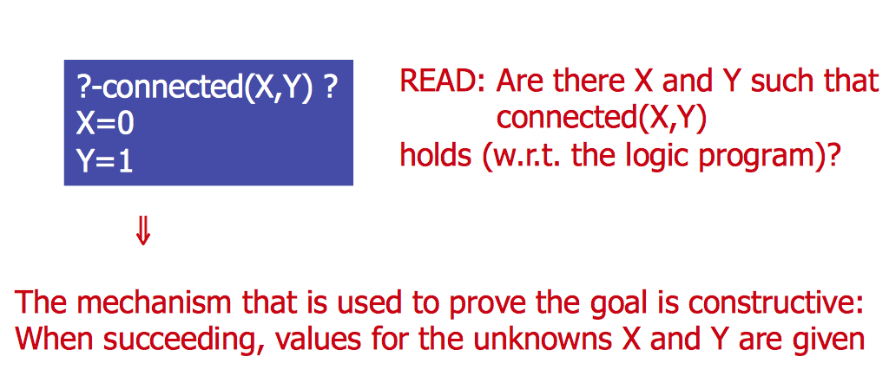
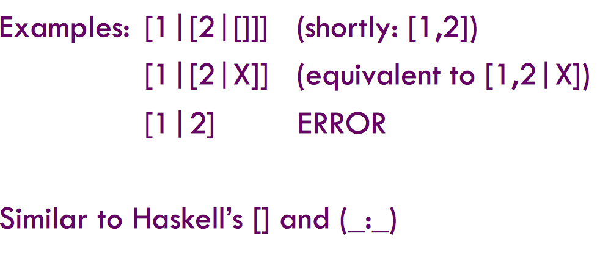
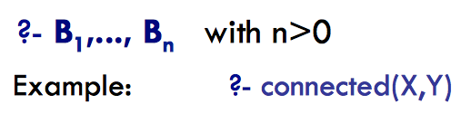
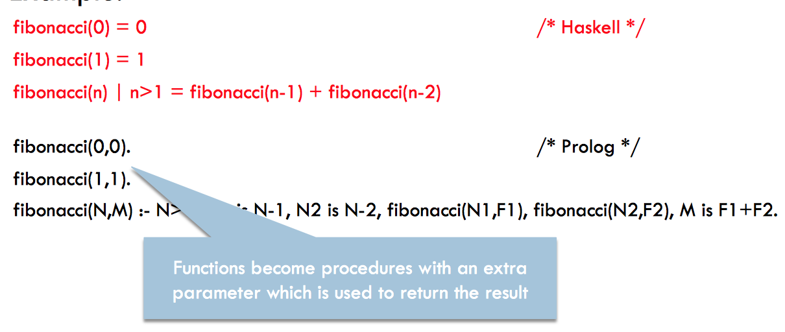
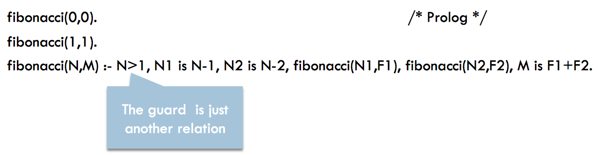
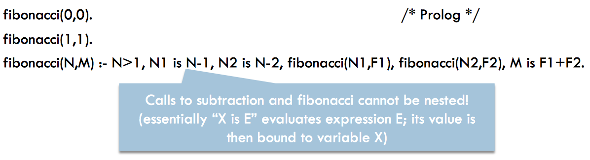
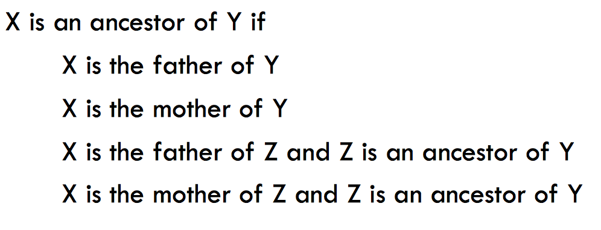

+ **Use of logic as a programming language** 
+ **Logical variables**
    + Answer extraction 
    + Invertible definitions
    + Non-deterministic

### Use of logic as a programming language
+ Logic programming implemets the revolutionary idea using ***logic as a programing language***
+ Writing a logic program consists of expressing a relation (or set of relations) by using a logic notation based on the predicate logic
+ The essential idea of the logic paradigm is that of **COMPUTATION AS A DEDUCTION**. This is in contrast to more standardd notions like **COMPUTATION AS CALCULATION** 

`Program: Express the knowledge of the problem => Write logic formulas`

`Program Execution: Express the problem to solve => Goal formula; deduction using queries`

### Logical variables
+ Program variables are unknowns (mathematical variables, like equations) 
+ Implicitly, logic formulas in programs are universally quatified

> Connected (X,Y) <= arc(X,Z) ^ connected (Z,Y) 


### Answer extraction 
**Variables in queries are existentially quatified** 

This is the outcome or ***answer*** to the query 

### Invertibility 
+ The predicate argumetns can be both input or output arguments

```prolog
member(H,[H|L]).
member(H,[X|L]) :- member(H,L). 
```
+ Check for memebership: member(2,[1,2])
+ Return the elements of a list: member (X,[1,2])
+ Generate the list containing an element: member(1,L)

> All of them are possible implementations with the above code, each of them, does a different thing depending on how you input the query

`Remeber that in prolog there are no types`

## Syntax of logic programs: Terms
**Data in logic programs are called terms and can be either:**
+ Variables: 
    + Prolog: variable identifiers begin with a **capital** letter. Anonymous variables are represented using "_"
    + Examples: X, Y, SquareArea … 
+ Constants: 
    + Prolog: numeric and symbolic (with identifiers beginning with a **lower case** letter or written in quotes) 
    + Examples: 42, 'a', peter, 'Peter'
+ Structured data f(t<sub>1</sub>, … t<sub>n</sub>) where f is a function symbol and t<sub>1</sub>, … t<sub>n</sub> are terms. 
    + Prolog: f is a data constructor beginning with a lower case letter
    + Examples: hour(h,m,s), name('Peter')

### Lists (Prolog notation) 
+ Lists are a particular kind of terms built out from: 
    + the empty list: []
    + the list constructor symbol [ \_|_ ]


### Syntax of logic programs: Atoms
+ **Atoms** are expressions p(t<sub>1</sub>, … t<sub>n</sub>) where
    + p is a predicate symbol of arity n (often written p/n), 
    + i.e. = a sequence of characters beginning by a lower case letter
    + t<sub>1</sub>, … t<sub>n</sub> are terms
+ Atoms express properties or relations (p) concerning data represented by terms t<sub>1</sub>, … t<sub>n</sub>
+ Example arc(1,2)

### Syntax of logic programs: Prlog programs
**A logic program is a set of sentences/declarartions that can be of two types: facts or rules
+ FACTS: single atoms followed by a dot **A**
    + Example:      arc(0,1).
+ RULES: having the form A:-B<sub>1</sub>,…,B<sub>n</sub>.
    + Example: `connected (X,Y) :- arc(X,Y), connected (Z,Y). `
    + where A and B<sub>i</sub> are atoms. 

> NOTE: facts can be seen as rules with an empty body, as follows: 
                       ` A :- true. `

### Syntax of logic programs: goals
+ The 'call' that serves to execute a logic program is called the goal an is written as a clause withou head:

##### note that, in sharp contrast to functional programming (FP), terms are ***not evaluated*** because goals rather consist of atoms

+ A clause without head nor body is called an **empty clause** and is represented as `?-`
##### The empty clause witnesses that the computation was successfully finished

### From Haskell to Prolog
+ Both Haskell and Prolog are **rule-based languages**. From a syntatic point of view, the main differences are that, in Prolog: 
    + There is no function (only procedures) 
    + Calls to such procedures cannot be nested
+ Example: 




### Examples
**Lenght of a list:** 

```haskell
-- haskell code: 
length [] = 0
length (x:xs) = length xs + 1
```
```prolog
/* Prolog code */ 
length([],0).
length([_|T],N) :- length(T,N1), N is N1+1. 
```
**List concatenation:** 

```prolog
/* Prolog */ 
append([],Y, Y).
append([X|R], Y, Z) :- append (R, Y, RY), Z = [Z | RY].
```
**Last element of a list:** 

# ACABAR DE COPIAR LOS EJERCICIOS DE LAS SLIDES

### Exercise
Specify the relationship "ancestor" by using a logic program: 

**Answer:**

```prolog
is_the_father_of('Peter','John').
is_an_ancestor_of(X,Y) :- is_the_father_of(X,Y).
is_an_ancestor_of(X,Y) :- is_the_mother_of(X,Y).
is_an_ancestor_of(X,Y) :- is_the_father_of(X,Z), is_an_ancestor_of(Z,Y).
is_an_ancestor_of(X,Y) :- is_the_mother_of(X,Z), is_an_ancestor_of(Z,Y).
```
### Procedural interpretation 


> SPACE 
