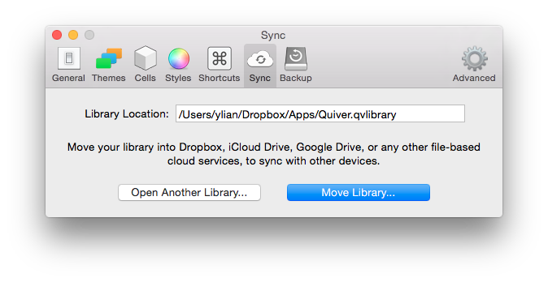

Quiver lets you sync notes across multiple computers via Dropbox, iCloud Drive, Google Drive, or any other file-based cloud services.

To set up cloud syncing, open the Sync tab in Preferences.
 

 

Move your library to Dropbox or other cloud services, then open the same library on another computer. From here on, all your notes will be synced across all the devices.

