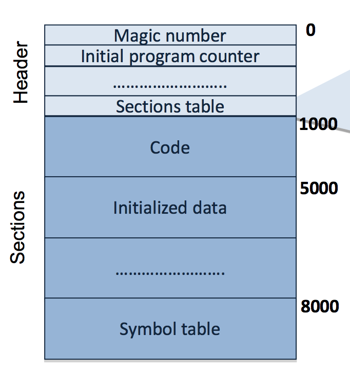
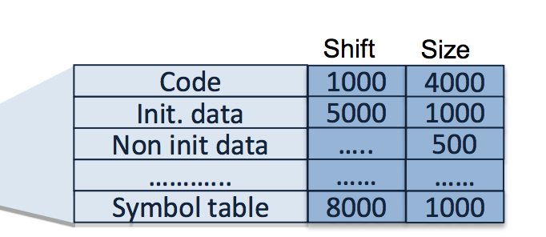
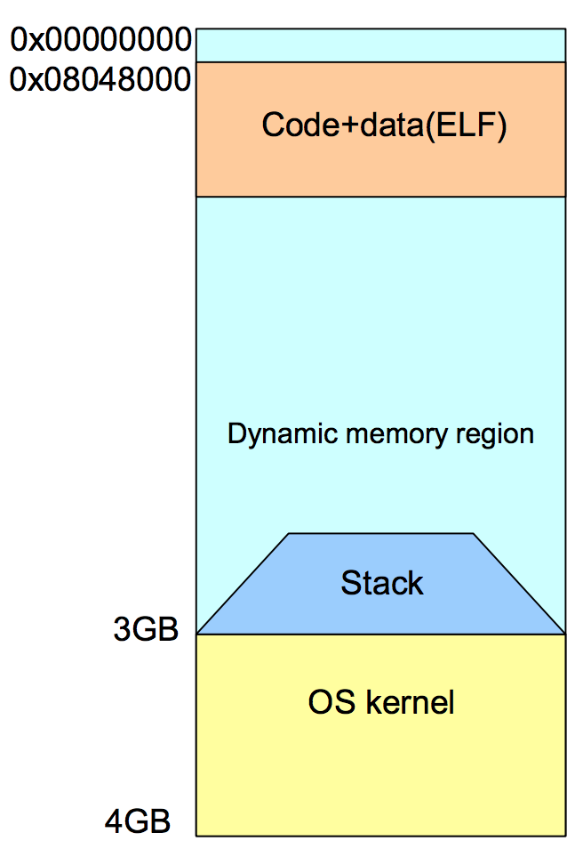
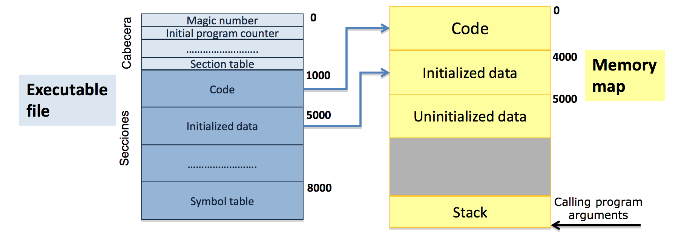
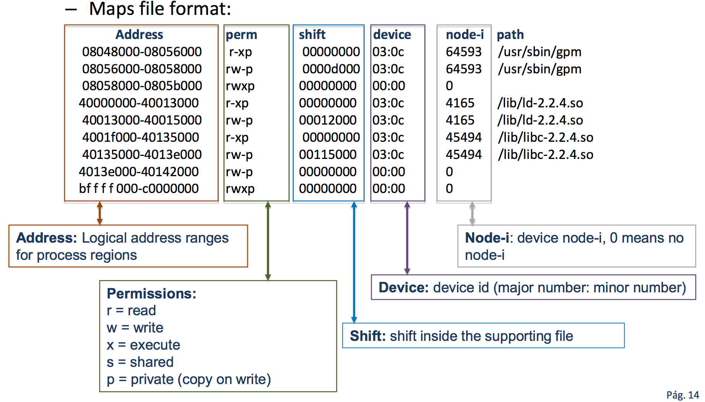
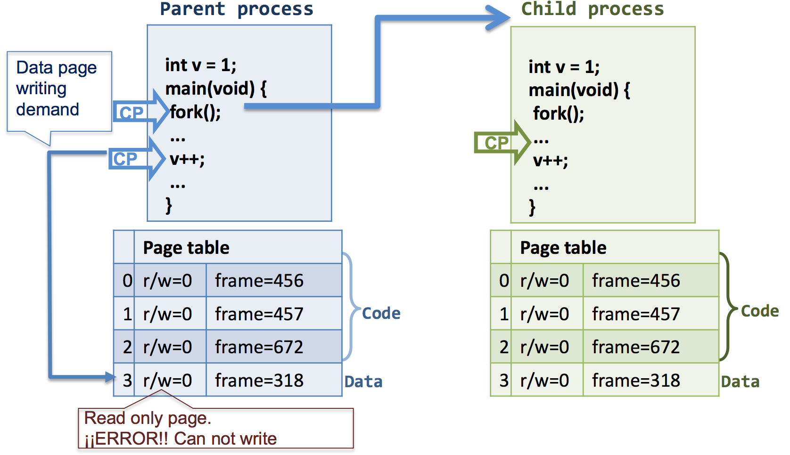
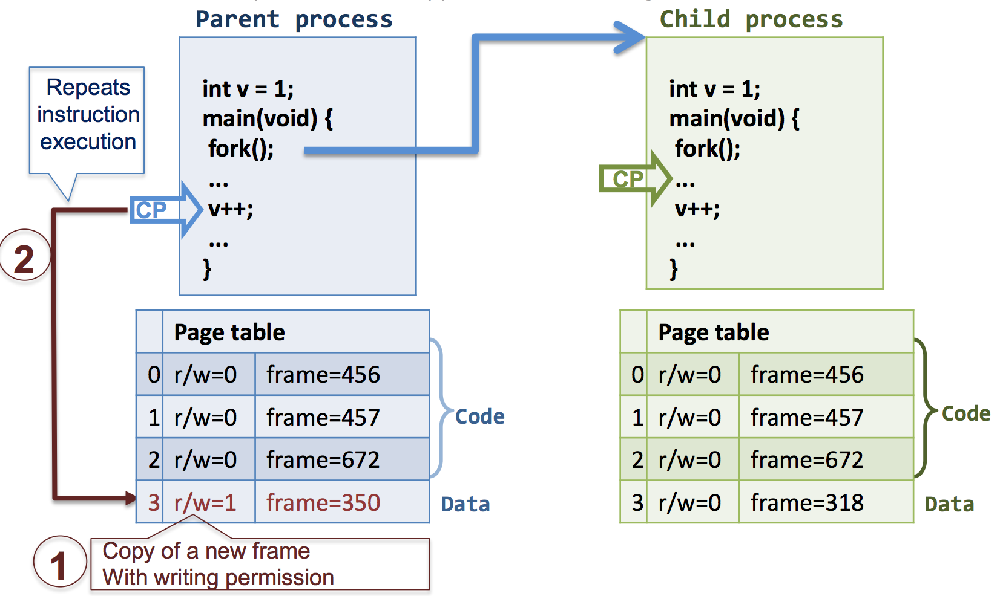

#### Process memory map
+ The OS manages the memory map of every process during its lifetime 
+ Memory map is a process **attribute** -> it is include in its PCB. (in its *Control* block) 
+ It contains information about a process memoery region (Code, data, stack)
+ The initial memory map of a process is strongly linked to its executable file
+ Nowadays OSs offer a dynamic memory model that gives support to process memory regions allocation: 
    + New regions could be created to allocate dynamic process entities: stack, mapped files, dynamic memory, etc
    + Unused regions could be removed

#### Simplified format of an executable file 
+ After compiling and linking an executable file is generated that contains the program machine code ready for execution 
+ An executable file is structured into a header and a sections set 
    + **Header:** It contains control info that allows reading into the remaining executable file content
    + **Sections:** Executable file content is organized in sections



+ There are commonly at least the following three sections: 
    + Code (text): It contains the program code
    + Initialized data: It stores all the variables with a value assigned in the program text 
    + Non-initialized data: It corresponds to variables without a value assigned in the program text



#### Memory map of a linux process 
Linux 2.6.x versions on 32 bits architectures:
+ Logical Space is 4GB 
+ 1st GB: Code + initialized data begin at address 0x08048000
+ 3rd GB: The satack starts here and grows downwards
+ 4th GB: The upper GB is reserved to the OS
+ The remaining space is available for data (uninitialized + heap) and dynamic linked libraries



#### Memory maps are regions made 
+ A region has a certain type of info associated 
    + Code, init data, uninit data, mapped files and dynamic linked libraries
+ A region is continuos memory chunk featured by the address inside the process memory map where it begins and its size
+ Region features: 
    + Suport: where the region information is stored
        + File support: region information is stored in a file 
        + Without support: region without initial content
    + Share type: 
        + Private (p) : content is only accessible by the owner process
        + Shared: content is accesible by several processes
    + Protection: (region access type allowed)
        + Read, write and/or execution 
    + Size: fixed or variable 
+ Program execution starts building a process memory map from the executable file 
+ Every executable file section becomes an initial map region 
    + Code (text): shared region, read and execution, fixed size, executable file support
    + Init data: private region (every process need private copy), read and write, fixed size, executable file support
    + Uninit data: private region, read and write, fixed size. without support (some compilers/languages initialize it to 0 ) 
    + Stack: private region, read and write, variable size, without support. It grows towards lower addresses. When execution starts it only contains calling program arguments



#### Process memory map is dynamic -> along process lifetime some regions can be created like:
+ Heap:
    + Dynamic memory support (ie pointers) 
    + Private, read and write, variable size, without support (init to 0) 
    + It grows towards upper address
+ Mapped files: 
    + When a file is mapped into memory, a new region is created
    + Variable size, file support 
    + Protection and sharing specified in the mapping 
+ Shared memory: 
    + Region that supports interprocess communication
    + Shared, variable size, file support (init to 0) 
    + Protection specified in the program
+ Thread stacks:
    + Every thread stack has its own region 
    + Same features as process stack 
    + 

#### There are two visualization methods of a process memory map:
+ Viewing the process maps file: **$cat/proc/PID/maps**
    + Logic adress range
    + Permissions
    + Shift form the beginning of the executable file 
    + Device
    + Node-i
    + Mapped file name 
+ Executing the shell command: **$pmap PID** 
    + Logical base address
    + Size 
    + Permissions 
    + Mapped file name 

> Replacing PID by variable && we refer to the process in execution like: 
+ $pmap &&
+ cat/proc/&&/maps

File /proc/PID/maps => it contains the actual memory regions associated to process PID and their access permissions



#### Copy-on-write
+ Linux technique to efficiently perform copies of memory pages (saves memory and time) 
+ When a process creates a new one, parent and child share data and stack pages in memory 
    + All shared pages are marked as "read-ony"
    + A write access attempt to these pages make the MMU send a page access failure interrupt, then: 
       + The kernel does a copy of the troubling pafe to the process that wants to write it
          + If there are more than two processes, the remaining processes continue being unable to write
          + If it remains only one process using the page it will be able to write changing previously its descriptor bit
          + The interrupted instrucion is restarted
+ **Advantage:** Time and space required to copy unused pages are avoided

### fork() call with Copy-on-Write



#### Memory mapped file
+ A file (whole or part) is included inside a process memory map 
> POSIX: mmap () 
  Win32: CreateFileMapping() 
+ Advantages: 
    + File access time improved (once mapped into memory access time is set by memory speed instead of hard disk) 
    + Intermidiate copies are avoided, the OS transfers data directly between mapped file memory region and file 
+ It is an alternative file access method instead of using I/O calls read and write
    + The file becomes an array of byte 
+ POSIX call mmap creates a new region in the process memory map and some of its properties can be set, like sharing and permissions

```c++
cadd_t  mmap ( caddr_t  addr,  size_t length,  int protec,  int indicator,  int fd, offt_t shift )
```
+ **addr:** memory address for file mappind. If 0 the OS decides. mmap always return the mapping address used
+ **fd:** file descriptor for the file to map (must be opened) 
+ **shift and length:** define the region to map the file, it is from shift to shift+length-1
+ **protec:** PROT-READ, PROT-WRITE, PROT-EXEC and combinations      
+ **indicator:** MAP-SHARED, MAP-PRIVATE
`I used - instead of _ because the program does not allow it`
+ **nummap:** remove a previous whole part file mapping

#### Dynamic linking libraries
+ Binary (no text) files that contain functions code
+ There are two way of linking prgrams with libraries: 
    + Static linking: the executable includes al library functions code
        + Program code = Own program code + Library function code
        + .lib files on Windows, .a files on UNIX
    + Dynamic linking: The executable file contains references to library function that it uses and the memory region required to store them  
        + Library functions are loaded in memory on demand mapping them in the correspondif process memory map region. This is done by the library loader program by means of ***dlopen*** call 
        + Windows: .dll files
        + UNIX: .so files 

#### Static linking
+ Disavantages: 
    + Generally big executable files
    + Library funtions code replicated in many executables in the file system and in memoery during execution 
    + A library update requiers rebuilding programs
+ Advantages
    + Executable files are self-contained

#### Dynamic linking 
+ Disadvanges: 
    + Executable files rely in library files
    + Dynamic linking introduces execution time overhead
+ Advantages: 
    + Smaller executable size that saves disk memory space
    + No library functions code replication 
        + Processes share library code in memory 
        + Library updates don't require rebuilding and several library versions can coexist


