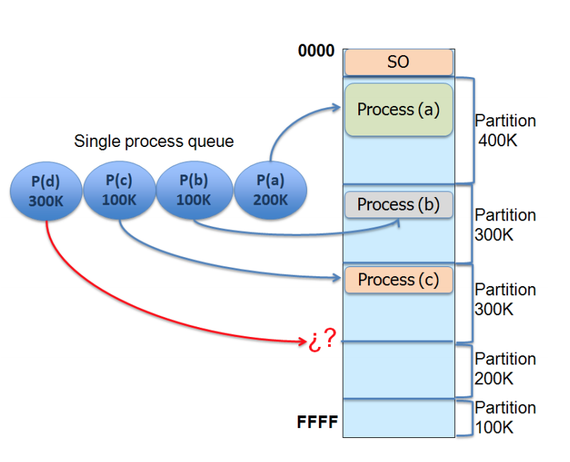
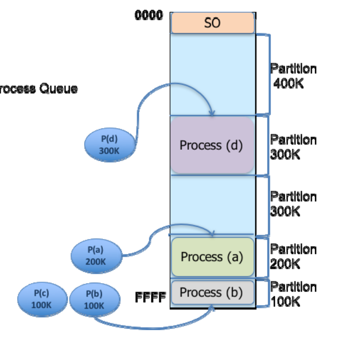
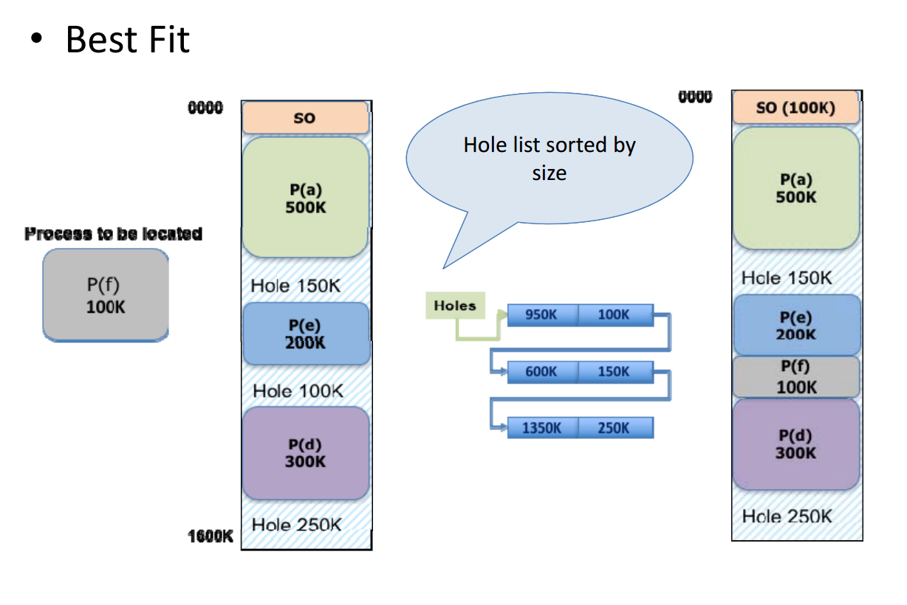
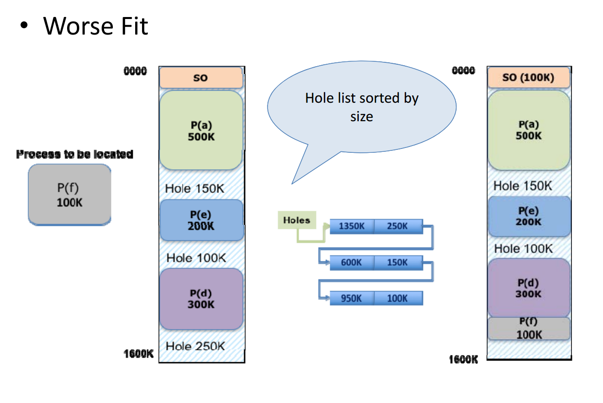
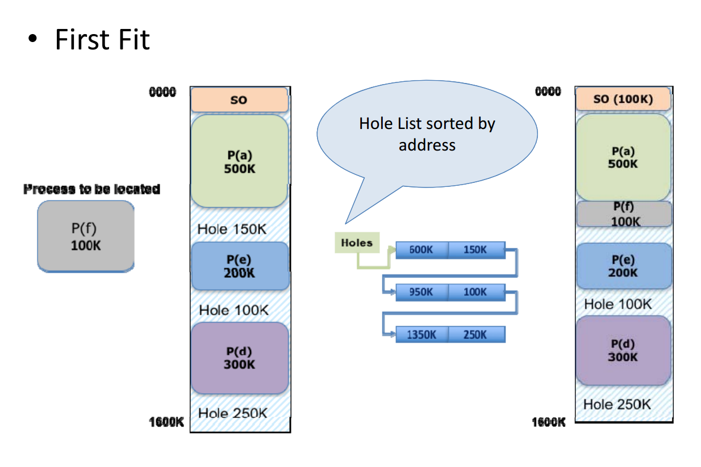
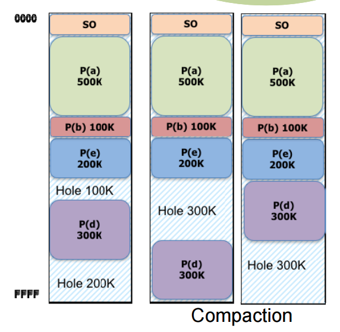
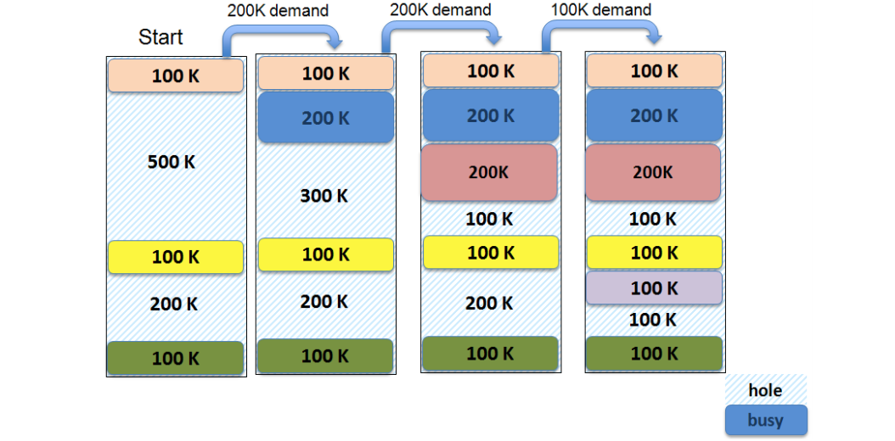

To execute a program: Both instructions and data must be allocated in main memory.
To get more system efficiency -> Multiprogramming 
  + Processes in a multiprogrammed system: 
    + share CPUs -> Process scheduling 
    + Share main memory -> Memory Mangement

Computer dynamic storage is available at several levels:
  + CPU registers
  + Cache memory 
  + Main memory 

### Main memory: 
  + It is made by a big binary word or byte vector, every one with its one physical address
  + It is a critical resource 
    + Its availability is fundamental (Access coninuosly) -> instruction execution cycle 
    + It has a limited allocation capability 

### Memory management issues include: 
  + Allocation
  + Protection 
  + Shortage
  + Relocation 

However modern OSs own techniques and mechanism to solve them: 
  + Logical address Space
  + MMU 
  + Dynamic libraries
  + Virtual Memory 
  + Allocation techniques 

### Logical Address
+ Every process has its own independent address space
+ It allows the code not being involved with machine features -> relocation

To be able to use physical address and logical address you require: 
+ A translation function from LA to PA
+ To decide how to implement it (Software/Hardware) 
+ When the translation is done: 
    + At compilation time: Absolute code => non relocatable 
    + At program load time: Relocatable code at load time 
    + At execution time: The process can relocate while it is executed 

### Memory Management Unit (MMU) 
Translating LA to PA is an overhead (gastos). 
So, we try to use minimum overhead by modifying the MMU hardware. 

### Contiguos memory allocation 
+ *Model* = A process is allocated in a unique section in memory with a contiguos range of physical addresses 
+ Memory is usually divided in two parts: 
    + The OS allocation area 
    + The user process allocation area 
+ *Strategies* 
    + A priory definition of memory section to allocate processes: **fixed partitions** 
    + To allow the system allocating processes into available holes: **variable partitions** 

#### Fixed partitions
+ Memory is supposed to be divided into different fixed size partitions
+ The OS maintains a free partitions list 
+ Variations: Single process queue & Multiple process queue
+ Problem is **Internal Fragmentation** 

### Variable partitions 
+ Initially process available memory is all available into a single hole 
+ As process demands arrive, memory is allocated
+ The OS maintains a free hole list with address and size 
+ Problem: **External Fragmentation** 
+ *Strategies*
    + Best Fit : Smallest satisfying hole is allocated 
  
    + Worst Fit: The biggest satifying hole is allocated
  
    + First Fit: The first found satisfying hole is allocated 
  

#### External Fragmentation: 
The added size of available holes may not be enough but it cannot be allocated because it is not contiguos
#### Compaction: 
+ External fragmentation solution 
+ Processes should be relocated in main memory 
+ Relocatable code at execution time required 

### Examples 
#### Example 1 

**ANSWER:** We can see that the algorithm used is worst fit. 

