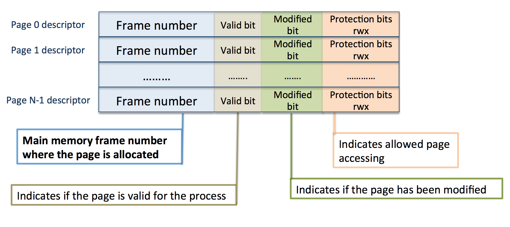
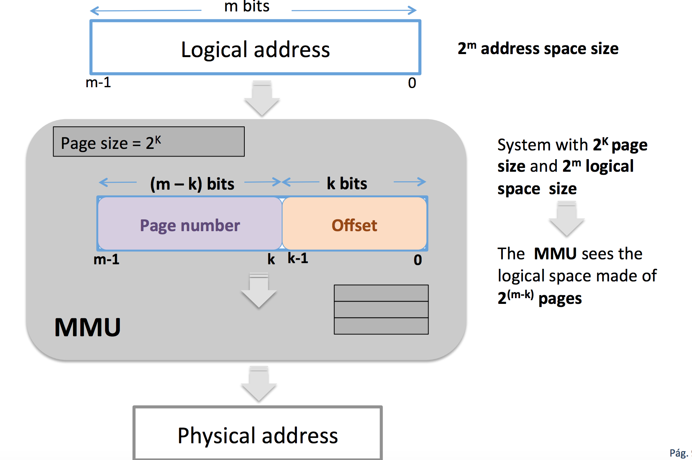
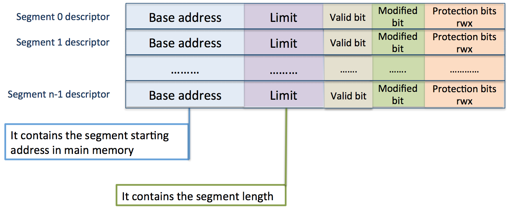

### Sparce allocation 
+ The logical memory space of a process is made up of fragments 
+ Every fragment is allocated into physical memory independtly 
+ The mapped physical memory space of a process doesn't need to be contiguos: 
    + Paging: fragments of fixed size 
    + Segmentation: fragments of variable size 
+ The MMU needs to know for every segment its location and size 
    + Page table
    + Segment table 

### Paging 
+ Allows non-contiguos allocation of process logical memory space
+ It is based on considering both logical and physical spaces divided into fixed size fragments
    + Pages in case of logical space
    + Frames in case of physical memory 
+ When a process enters the system the OS loads all its pages in physical memory frames
    + Every page fits a frame
    + A table is built to store the frame number where every process page is allocated
    + Every process has its page table 

### Page table
+ Every table entry is called page descriptor and contains: 
    + The page allocated frame number 
    + A set of control bits: valid bit, modified bit and protection bits 

### Logical address structure 

### Example => Paging on a 32-bit fragmentation 
+ Page size: 4K -> 4K = 2^(12) = 4096 , so k = 12
+ Number of page sizes: 2^(20) = 1M = 1048576 ( m - k = 32 - 12 = 20 bits ) 

### Advantages: 
+ Ther is no external fragmentation 
+ It eases reallocation 
+ It provides protection 
+ Code pages are shared between processes

### Disadvantages
+ Internal fragmentation: page size should be an integer power of 2 to ease getting page number and offset 
    + Big pages: a lot internal fragmentation 
    + Small pages: very big pages tables 

### Page table implementations 
+ MMU registers 
    + Only feasible for small logical spaces (few spages) 
+ Memory 
    + The page table base register (PTBR) is kept with the page table starting physical address 
    + An additional memory acces is required (page table access) to translate a logical address 
+ TLB (translation look-aside buffer) 
    + The TLB contains only a small subset of page table entries (the ones recently used) 
        + Much faster than memory implmentation 
        + High hit rate with few entries

### Segmentation 
+ Process logical space is divided into variable length fragments
+ Logical space is a set of segments
+ Every segment has its name and size 
+ Segments are defined by the compiler
    + Code segment
    + Data segment 
    + Stack segment
> A segment is always contiguosly allocated in physical memory 

+ When a process enters the system the OS loads all its segments in main memory 
+ A table is built to store the starting physical address and length of every segment 
    + Every process has an associated segment table 

### Segmet table
+ Every segment has an entry in the segment table called segment descriptor that contains 
    + Starting (base) elements physical address
    + Segment size
    + Set of control bits: protection bits, valid bit and modified bit 

### Logical address structure 

### Advantages
+ There is no internal fragmentation 
+ It eases reallocation 
+ It provides protection and segment code sharing

### Disavantages 
+ External fragmentation 

### Segment Size 
+ Big => big external fragmentation (same as variable partitions)
+ Small => little external fragmentiation but very big segment tables
+ Fixed Size => same as paging 

### Multilevel Paging 

Definition: To page the page table itself, that means to break it in such a way that every page table fragment will fit a memory frame 

### Segmentation with paging 

+ Problem: When segment become big: 
    + Increases external fragmentation 
    + It is more difficult to find a free memory hole to allocate it 
    + There is a dynamic memory allocation problem due to the different segment sizes 
+ The solution is Segmentation with paging

+ When a process enters the system the OS loads all pages from every process segment in main memory frames
    + Segment table
    + Page table for every segment
+ A table is built to store for every segment its page table starting address and its segment size  

> SPACE 

