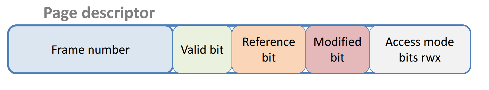
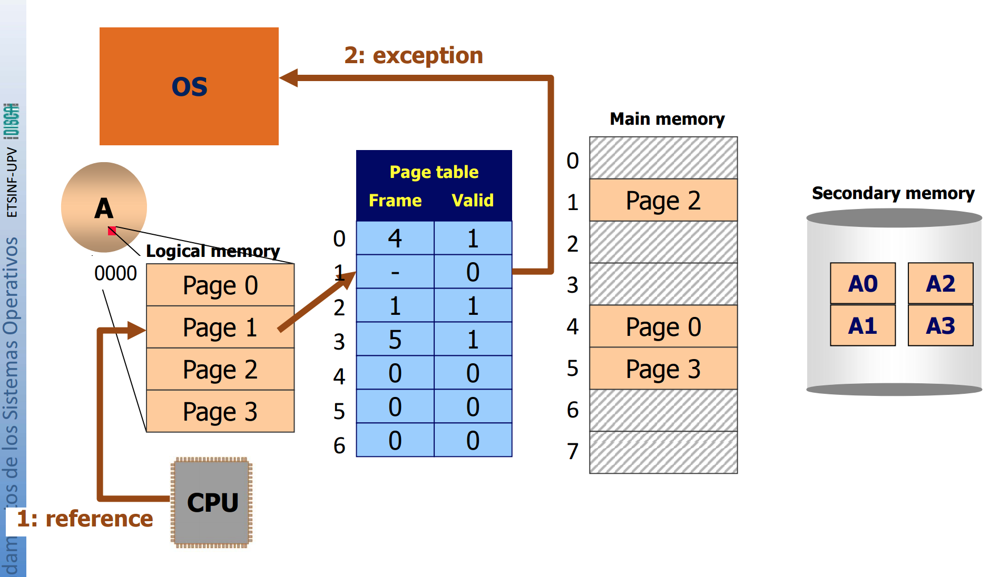
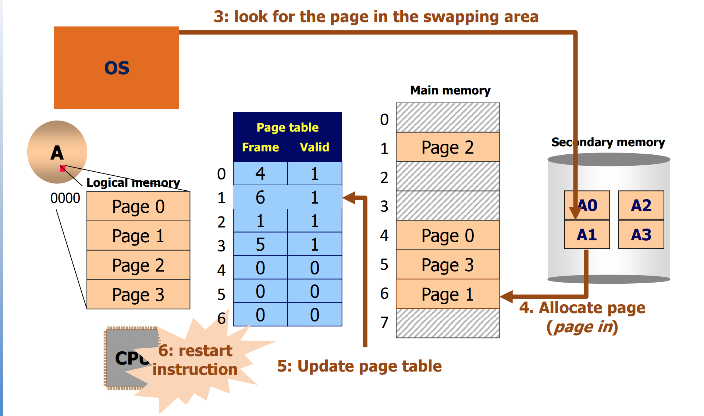
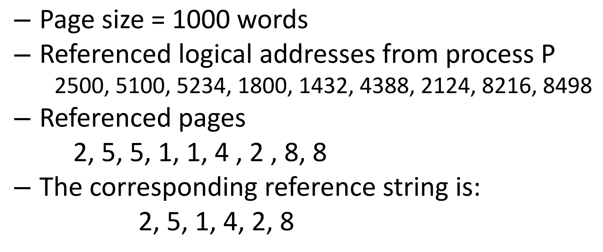
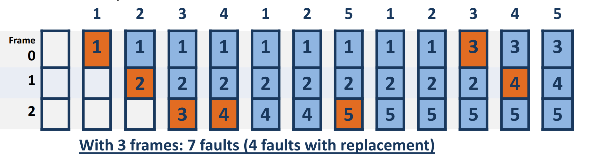
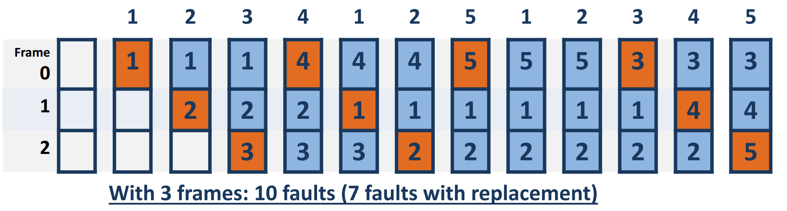

### Concept 
Paging without virtual memory :
+ The OS reserves all the physical memory required by a process to start it 
+ All memory accesses take the same amount of time 
+ When a process end the OS releases all the frames used by the process 

Memory requirementes chenge due to dynamic regions
+ The stack grows due to function calls
+ Dynamic memory allocation creates the heap region that can grow and shrink due to *malloc* and *free* calls
+ Creating new threads stack region

**Reference locality principle** 
+ Indepently of the logical size of a process its memory accesses are located into hot spots: 
    + Given a time interval a small set of instructions is accessed particularly inner loops, something similar happens with data access
    + Along the process lifetime hot spots of code and data move

**Memory mangement based on virtual memory** 
+ The OS manages memory allocation to processes in such a way that only their hot spots are allocated on physical memory 
+ The remaining logical space content is allocated on secondary storage (swaping area) 

**Virtual memory base tecnologies** 
+ It combines physiscal memory (RAM) with secondary storage (hard disk or SSD) 
+ Main memory is made of words (i.e. 32-bit, 64-bit) addresable by the CPU, access time is a couple of nanoseconds 
    + Every instruction cycle performs one or more accesses to main memory 
+ Secondary storage is made of blocks (i.e. 512-bytes, 4096-byte), access time is a couple of milliseconds
    + A page transfer is made in one single I/O operation that requires the execution of serveral instructions by the CPU  

### Virtual memory scheme 
+ The OS manages memory following a sparse allocation approach, typicaly paging
+ A swap area is available on disk, as a partition or as a system file
+ For every page in use by a process it can be in two states: 
    + Valid: page allocated into a main memory frame
    + Invalid: page not allocated in main memory but on the swap area 
+ For every memory acces it can happen a: 
    + Hit (most common) : reference to a valid page 
    + Fault: reference to an invalid page -> the page table has to be updated and one or more pages are transfered between main memory and the swap area
+ Benefits: 
    + The same as paging: paging sharing and protection 
    + It saves memory and increases the multiprogramming level
    + It allows bigger executable process size
    + It easies dynamic memory management
+ Penalties:
    + Turaround time can increase due to page faults 
    + Workload of secondary storage increases
    + Great OS design complexity 

### Virtual Memory Support 
Every page descriptor has the following fields: 
+ Frame number where the page is allocated in physical memory 
+ Valid bit: it indicates if a page is mapped in memory, it supports demand paging 
+ Reference bit: it indicates page access done. It is required for a second opportunity algorithm 
+ Modified bit: it indicates page write access done. Trouble with shared pages. 
+ Access mode bits: read only, read-write, execution 

**Page fault -> MMU Exeption**
+ It happens when a non memory allocated page is referenced, that is with valid bit = 0
+ Page fault cases: 
    + Page on disk: The reference page belongs to the process => it is allocated into a memory frame 
    + Access error: The reference page doesn't belong to the process and cannot be assigned to it => the process is aborted
    + Process growing: The process asks for new pages, if the OS permits it, a new page is assigned to the process with its bit set and the new page is allocated into a memory frame 

### Demand Paging
**Page fault: Page on disk case**

**Page fault algorithm: page on disk case** 
+ Find demanded page on disk 
+ Find a free frame
    + If there is a free frame, then use it
    + If there are no free frames apply **page replacement algorithm**
+ Read demanded page on disk (page in) and allocate it into the free frame
+ Update page table of the process that generates the page fault 
+ Update free frame table
+ Transfer control to user process
    + Restart the instruction that has produced the page fault 

**Page replacement:** It is required when the main memory is full and there is a page fault
+ Select an allocated page in main memory, named victim, to leave its frame
    + There are several victim selection algorithms 
+ If the victim page has its modified bit equal to 1 then save the victim page to disk (page out) 
+ The victim page entry on the page table is updated with valid bit = 0
+ Update the free frame table

**Reference String:** Sequence of accessed pages along a certain time period
+ From every logical address sent by the processor its page number is obtained
+ Repetitions are removed: several consecutive references to the same page are replaced by a single reference

*Example*

### FIFO replacement algorithm 
+ FIFO = First in first out
+ Victim page: The one that is longer loaded in memory

### Optimal Replacement algorithm 
+ Vitim page: The one which takes longer to be referenced
+ Minimum number of faults => **IMPOSIBLE TO IMPLEMENT** (future is unknown) 

### LRU replacement algorithm 
+ LRU = Least recently used 
+ Victim page: the one that lasted more without being referenced
+ It is a stack algorithm 

**LRU Implementations**
+ Using counters: 
    + Every page has an associated counter
+ Using an ordered list of referenced pages
    + When a page is referenced it is put at the end
    + The victim page is the first one 

**Performace analyis**
+ Advantages: 
    + Good approach to the optimal algorithm 
+ Disadvantages: 
    + Costly implementation => requires hardware support
+ Solution: 
    + LRU approximation algorithms => based on reference bit  

> SPACE 
