### File system architecture 
File system architecture has three aspects: 
1. How files are organized from the user point of view 
2. How files are stored in secondary storage (commonly disks) 
3. How file operations like reading, writing, positioning, etc. are done 

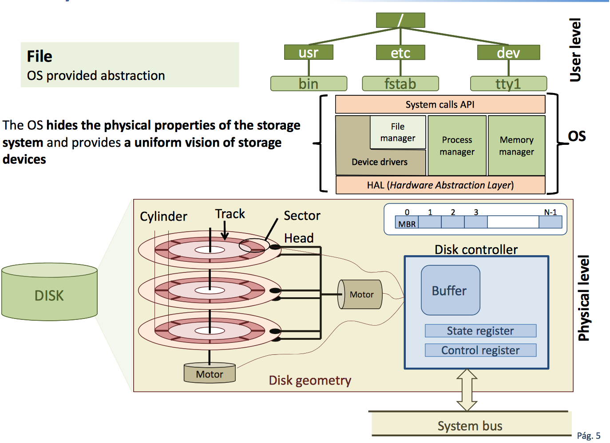

The file system provides mechanisms to: 
+ **Persistent Storage** of information 
    + Information stays in the computer when it is switched off, the most common device nowadays is the hard disk 
+ **Access to information**
    + A *user interfance* made of: 
        + Files: logical unit for persistent storage of data
        + Directories: mechanism (container) to organize files 

Importance: 
+ It keeps system critical data
+ It constrains global system performance
+ It is the most visible and used aspect of an OS 

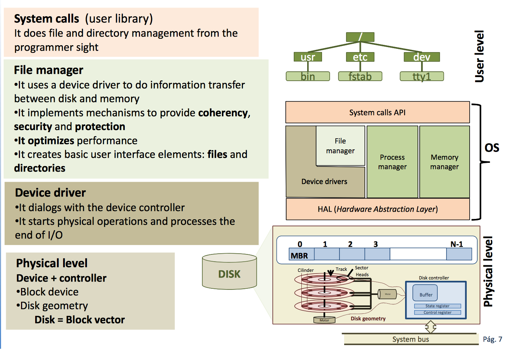

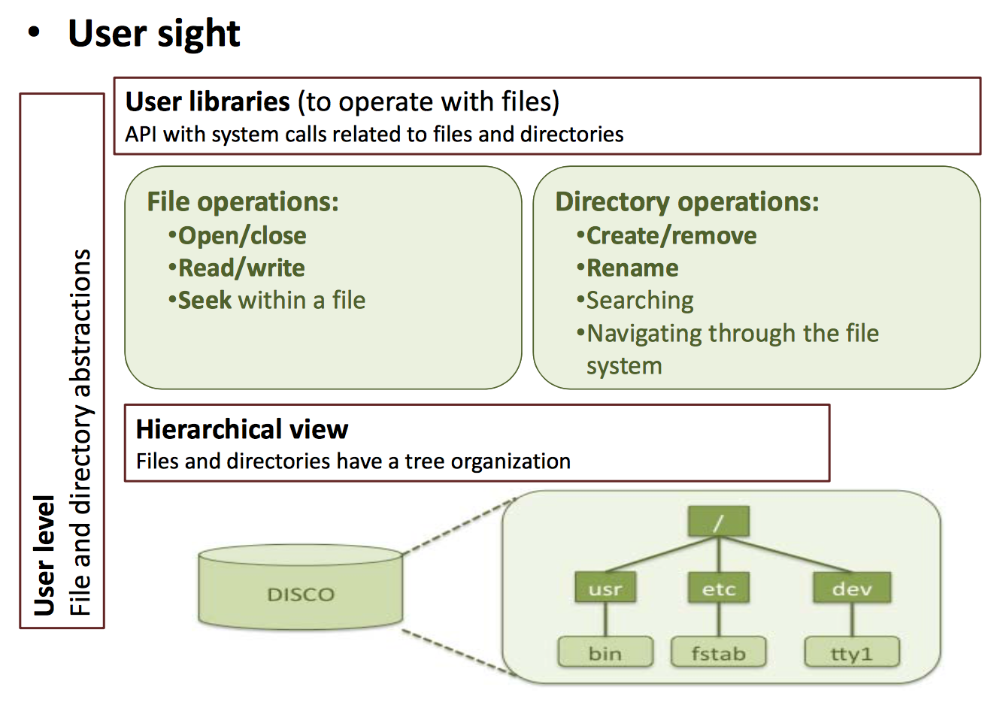

**Open file call** 
+ System call that allows accessing file content
    + Processes must open a file before reading or writing on it 
    + The calling Process receives a file handler that will reference the file in future reading or writing operations 
+ It stablishes the file acces modes (read and/or write) and the initial position on the file of the acces pointer 
    + For instance, when accesing a file in writing mode
        + Locating the acces pointer at the beginning (0) to overwrite the whole file content 
        + Locating the access pointer at the end (filesize -1) to add new content to the file
    + Upcomming accesses will start at the acces pointer location left in the last access and will update it
+ File access permissions are checked
    + Open call will fail if the mode specified is inconsistent with the file permissions

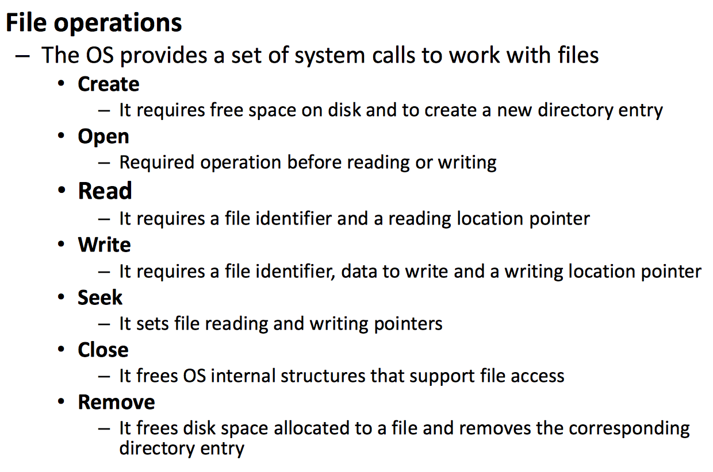

### File concept
**A file is:**
+ An abstract data type
+ An interrealted information collection established by its author 
+ The required element to write information in secondary storage 

`File = Attributes + Data `

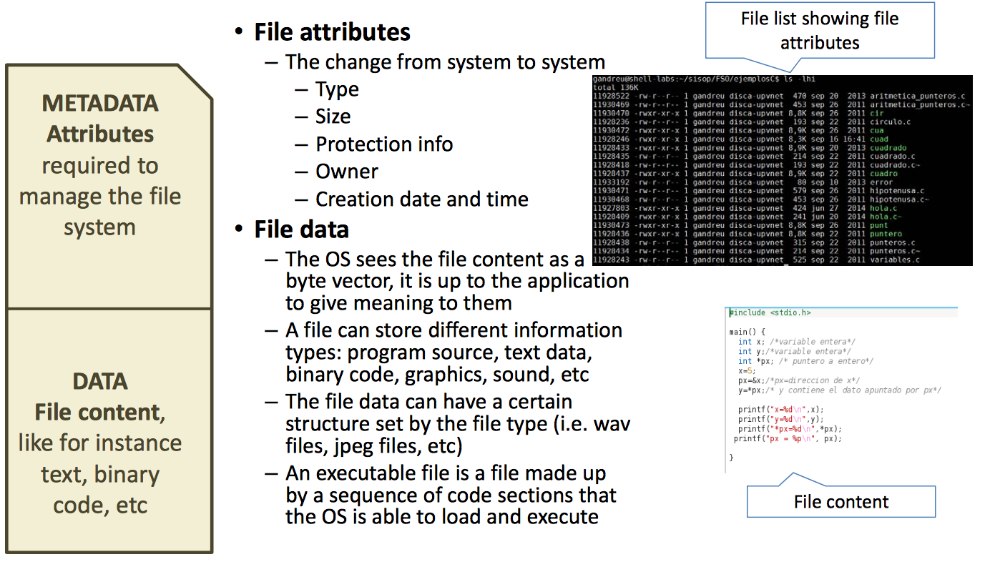

`When you see the files (MyPC for instance) you are seeing the metadata, no the data. To see the data you have to double click and you are now able to navigate through the files`

**Access methods to file data** 
There are three access modes to file information: 
+ **Sequential**
    + Information is accessed (reading or writing) in order
    + In every read/write operation the location pointer is implicitly updated 
+ **Direct** 
    + The file is made up of logical registers
    + In every operation an argument indicates the working register
+ **Memory mapping**
    + The file is allocated in a logical memory range of one several processes 
    + In this way file read/write ops are transformed into main memory read/write ops
    + The OS is in change of updating inforamtion into disk 

### File block allocation 
How to allocate disk space to files?
+ Modern OSs view hard disks as a numbered set of fixed size byte blocks
+ It requires: 
    + Efficient use of disk space
    + Fast access to files
+ Allocation squemes: 
    + Contiguos
    + Linked
    + Indexed 

**Contiguos allocation**
+ A file is allocated as a set of consecutive disk blocks 
+ It is defined for evey file as the first allocated block address and the file length in blocks 
+ A convinient usage is: **A CD as you are only going to write once**

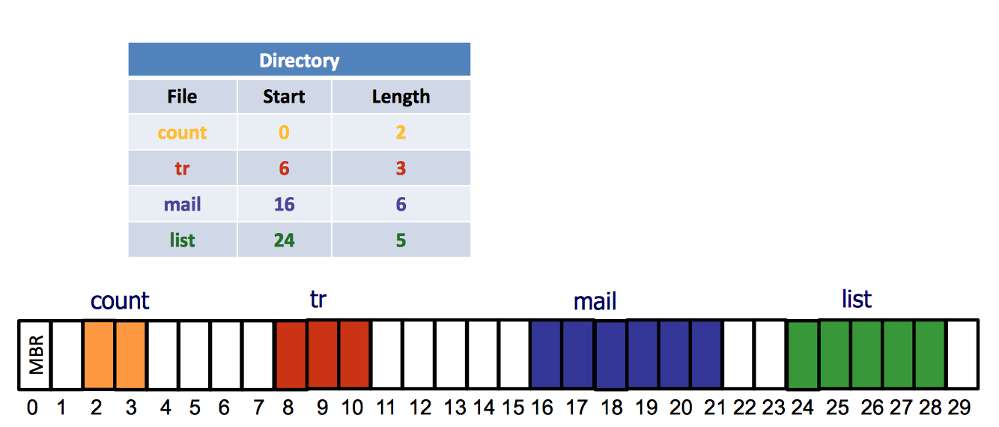

`IN THE TABLE, START COLUMN => COUNT AND TR ARE 2 AND 8 RESPECTIVELY`

**Linked allocation** 
+ File allocated blocks do not need to be contiguos, then every block is linked to the next by means of a pointer. 
+ To allocate a file you just need the first one as every-one of them are connected
+ Not good for performace 

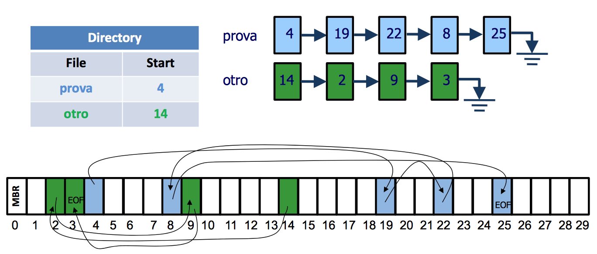

**FAT** - variation of linked allocation 

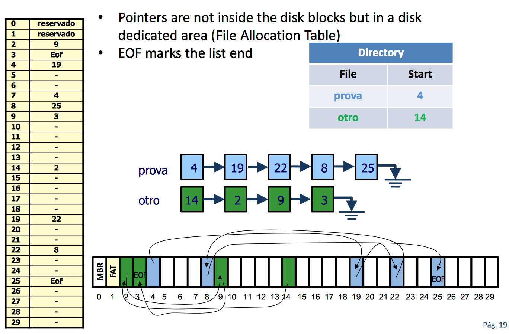

`in the yellow table the number at the right of the position is the linked position. So in 4, the next position is 19, from 19 is 22 and so on`

**Indexed allocation**
A block could be index block or data block, a index blocks contains pointers to data blocks

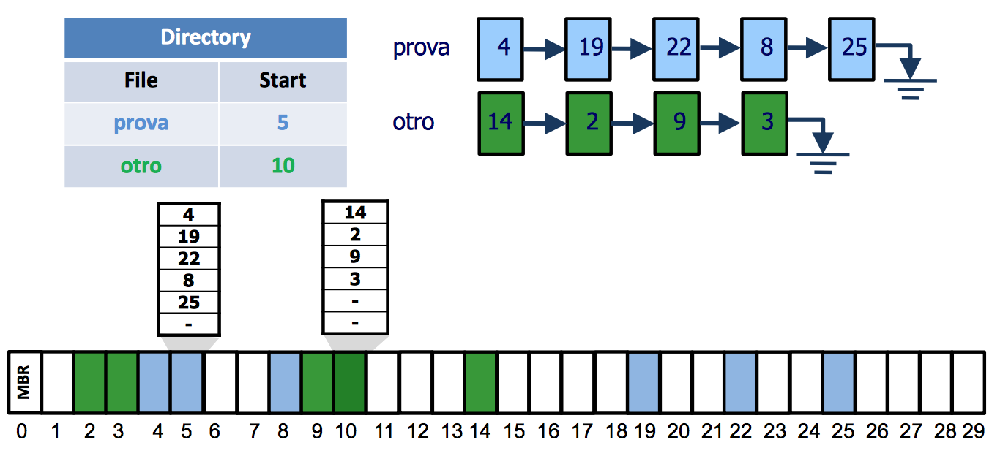

`Here it starts at 5 not at 4 because 5 is the first block of pointers. 4 would be the block of data.`

Example: 
1 block = 512 bytes
1 pointer = 32 bit = 4 bytes 

512 / 4 = 128 bytes => Which would be the maximum number of blocks that a file can have (in this case) 

**Multilevel indexed allocation** 
+ It is a variation of indexed allocation 
+ Motivation: 
    + Supporting big files requires several index blocks
+ Solution
    + A pointer can point to a data block or to another index block 

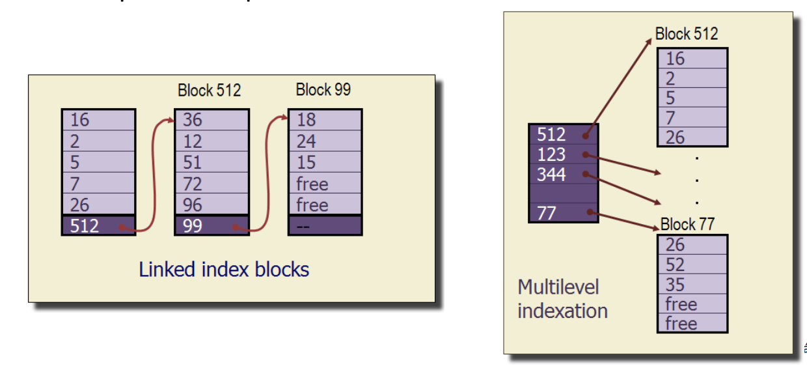

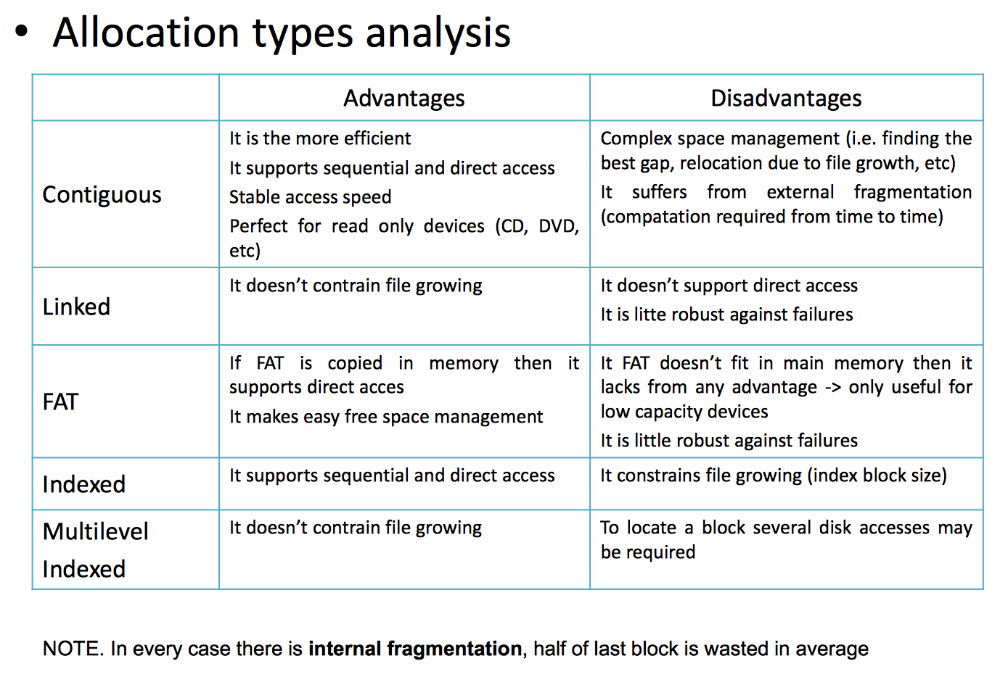

> SPACE 
