## What is network security? 
**Confidentiality:** only sender, intended receiver should "understand" message contents
+ Sender Encrypts message
+ Receiver decrypts message

**Authentication:** Sender, receiver want to confirm identity of each other 
**Message integrity:** Sender, receiver want to ensure message not altered (in transit, or afterwards) without detection 
**Access and availability:** Services must be accessible and available to users 

### Intruders: Passive vs Active
***Passive Intruder (poco a poco)***
Attempt to learn or make use of information from the system but does not affect system resources
+ Monitor transmission to obtain message contents or traffic analysis
+ Eavesdropping (saving bank account, password and using them later) 
+ Difficult to detect because is no alteration of data 

***Active Intruder (a saco)***
Attempt to alter system resources or affect their operation 
+ Modification of messages in transit
+ Denial of service
+ A typical active attack is one in which an intruder impersonates one endof the conversation, or acts as a man-in-the-middle 

***What can "bad girls (and guys)" do?****
+ Eavesdrop: intercept messages
+ Actively *inser* messages into connection 
+ Impersonation: can fake source address in packet (attacking from your IP)
+ Hijacaking: "take over" ongoing connection by removing sender or receiver, inserting himself in place
+ Denial of service: prevent serive from being used by others 

## Principles of Cryptography
### What is Cryptography? 
+ Cryptography derived its name from a Greel word called "Kryptos" which means "Hidden Secrets" 
+ Cryptography is the practice and study of hiding information. Is te Art or Science of converting a plain intelligible data into an unintelligible data and again retransforming that message into its original form 
+ It provides Confidentiality, Integrity and Accuracy. 

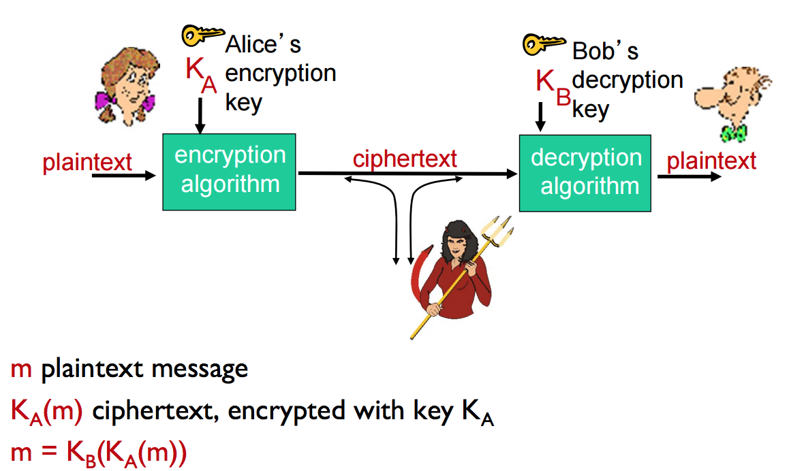

### Breaking an encryption scheme
+ **Cipher text only attack** Trudy has ciphertext she can analyze
+ **Two approaches:**
    + Brute force: Search through all keys 
    + Statistical analysis
+ **Known-plaintext attack:** Trudy has plaintext corresponding to ciphertext
    + Eg: in monoalphabetic cipher, Trudy determines pairings for a,l,i,c,b,e...
+ **Chosen-plaintext attack:** Trudy can get ciphertext for chosen plaintext

### Cryptographic algorithms
The cryptogrphic algorithms, based on the number of keys that are employed for encryption and decryption, can be categorized in three types of algorithms
+ *Symmetric key Cryptography (SKC):* Uses a single key for both encryption and decryption. Primarily used for privacy and confidentiality
+ *Public Key cryptography (PKC):* Uses one key for encryption and another for decryption, also called ***asymmetric encryption***. Primarly used for authentication, non-repudiation, and key exchage 
+ *Hash functions:* Uses mathematical transformation to irreversibly "encrypt" information. providing a digital fingerprint. Primarily used for message integrity. 

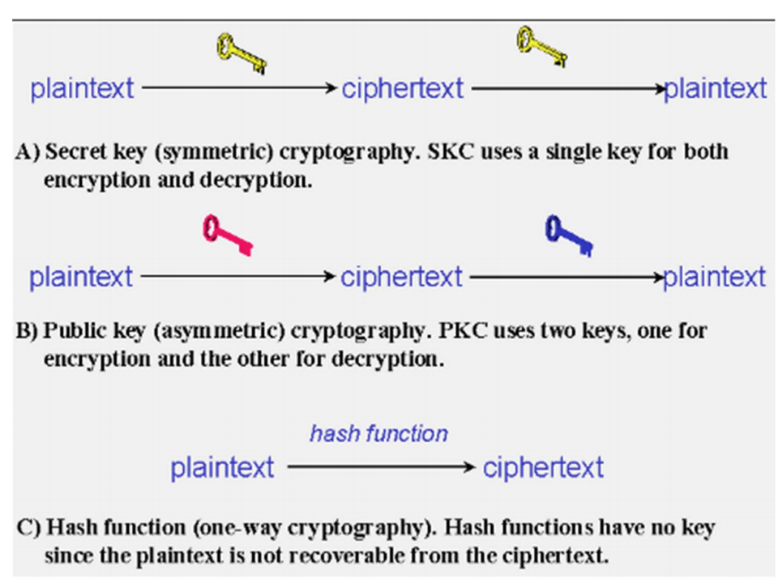

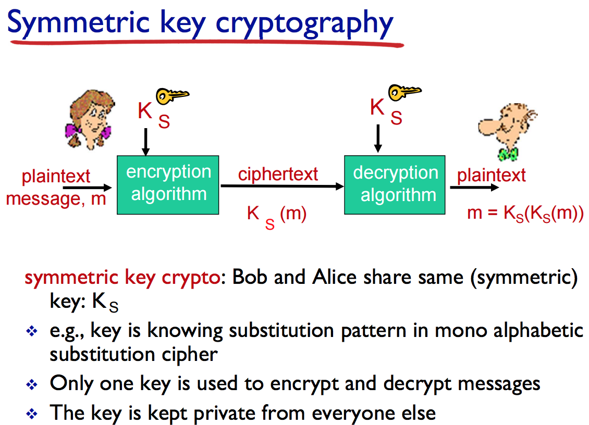

### Simple encryption scheme 
**Susbtitution cipher:** substituting one thing for another 
**Monoalphabetic cipher:**Substitute one letter for another

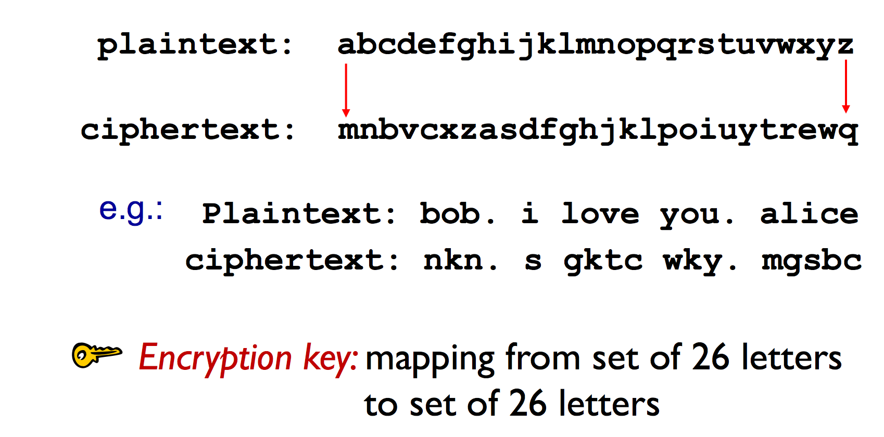
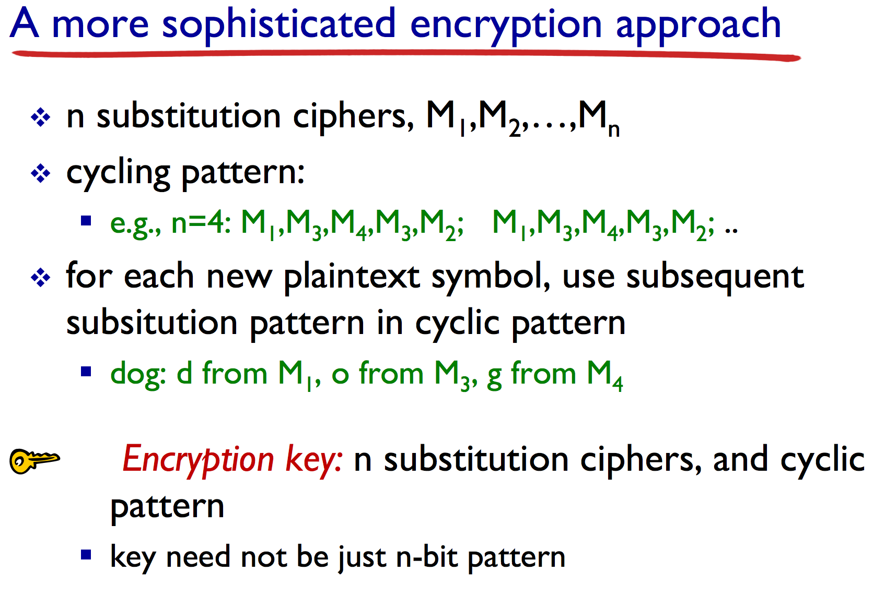

### Two schemes of symmetric key cryptography
Symmetric key cryptography schemes are generally categorized as being either *stream ciphers or block ciphers* 
+ **Stream ciphers** operate on a single bit (byte or computer word) at a time
+ A **block cipher** is so called because the text message is fragments into blocks of identical size, and then the scheme encrypts one block of data at a time using the same key on each block 

### Symmetric key cryto: DES 
`DES = Data Encryption Standard`
+ US encrytption standard [NIS 1993]
+ 56-bit symmetric key, 64-bit plaintext input
+ Block cipher with cipher block chaining
+ How secure is DES? 
    + DES Challenge: 56-bit-key-encrypted phrase decrypted (brute force) in less than a day 
    + No known good analytic attack 
+ Making DES more secure: 
    + 3DES: Encrypt 3 times with 3 different keys 

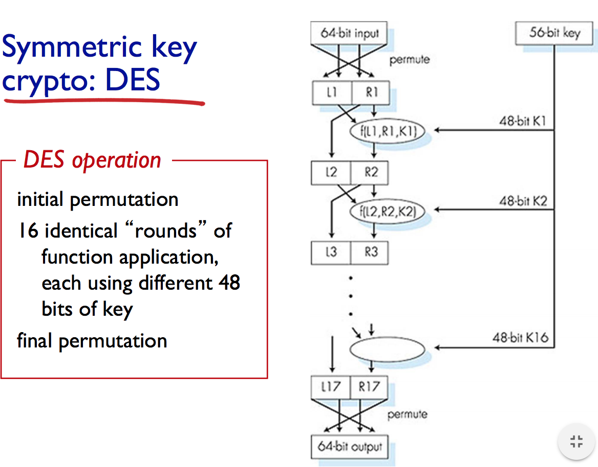

### AES: Advanced Encryption Standard
+ Symmetric-key NIST standard, replaced DES (Nov 2001)
+ Uses more bits, different length of iteration (bits changed) and permutes the keys each iteration. 
+ Processes data in 128 bit blocks 
+ 128, 192 or 256 bit keys 
+ Brute force decryption (try each key) taking 1 sec on DES, takes 149 trillion years for AES

### Public Key Cryptography 
**symmetric key crypto:** 
+ Requires sender, receiver known shared secret key 

**Public key crypto:** 
+ Radically different approach 
+ Sender, receiver do *not* share secret key
+ *public* encryption key known to *all*
+ *private* decryption key known only to receiver 

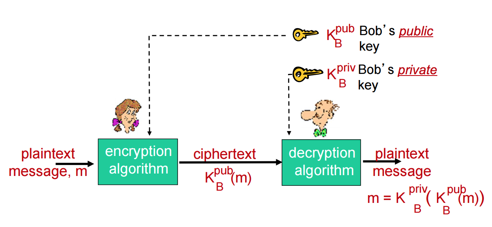

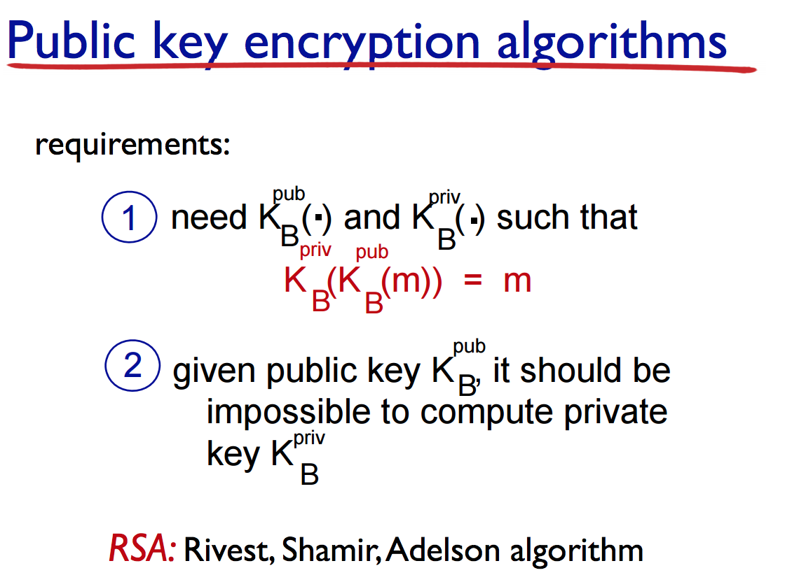

### Prerequisite: modular arithmetic
+ x mod n = remainder of x when divided by n 
+ facts: 
    + [(a mod n) + (b mod n)] mod n = (a+b) mod n 
    + [(a mod n) - (b mod n)] mod n = (a-b) mod n 
    + [(a mod n) \* (b mod n)] mod n = (a*b) mod n 
+ thus 
    + (a mod n)d mod n = ad mod n 

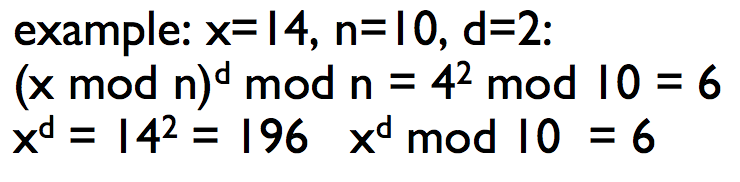

### RSA: getting ready 
+ Message: just a bit pattern 
+ Bit pattern can be uniquely represented by an interger number
+ thus, encrypting a message is equivalent to encrypting a number 

*example:*
+ m = 10010001. This message is uniquely represented by the decimal unmber 145
+ to encrypt m, we encrypt the corresponding number, which gives a new number (the ciphertext) 

###RSA: Creating public/private key pair
1. choose two large prime numbers p,q. (eg: 1024 bits each) 
2. Compute n = pq, z = (p-1)(q-1) 
3. Choose e (with e<n) that has no common factors with z (e,z are "relatively prime") 
4. Choose d such that ed-1 is exactly divisible by z. (in other words: ed mod z = 1) 
5. Public key is (n,e). private key is (n,d). 

###RSA: encrytion, decrytion 
Given (n,e) and (n,d) as computed above 
1. to encrypt message m (<n), compute c = m^e mod n 
2. to decrypt received bit pattern,c, compute m = c^d mod n 

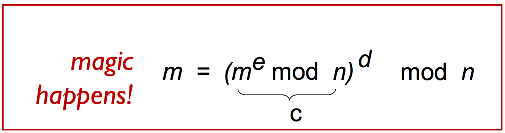

###RSA: Example 

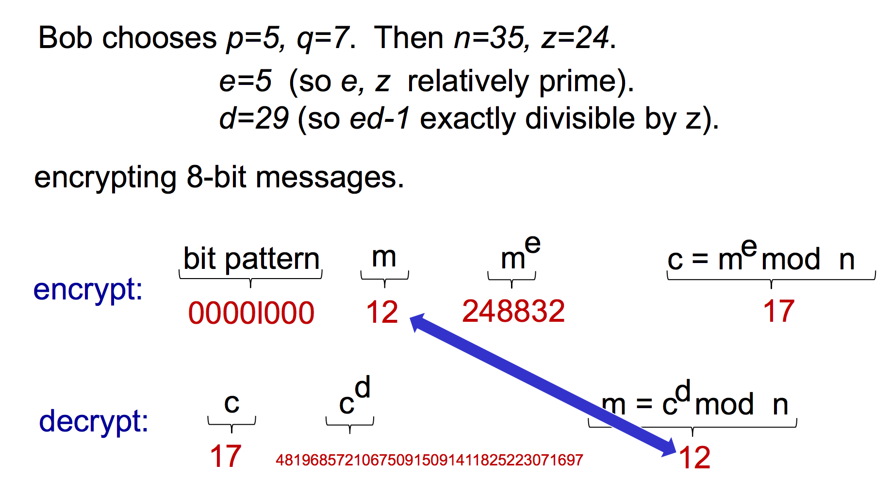

###Why does RSA work? 
+ Must show that cd mod n = m 
    + where c = me mod n 
+ Fact: for any x and y:xy mod n = x(y mod z) mod n 
    + where n = pq and z = (p-1)(q-1) 
+ thus, 
    + cd mod n = (me mod n)d mod n 
    + = med mod n
    + = m(ed mod z) mod n 
    + ml mod n 
    + = m 

> SPACE 
