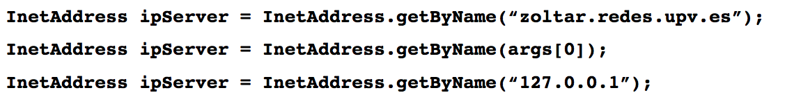
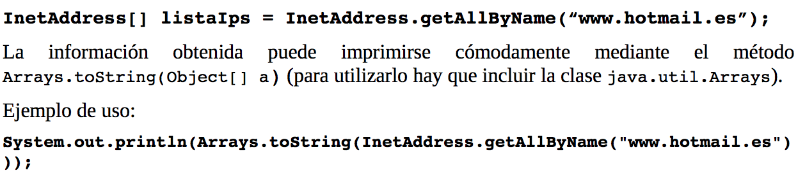

### Intro 

El protocolo UDP no establece "conexión" entre cliente y servidor. El emisor debe indicar explícitamente la dirección IP y el puerto del destino en cada datagrama. Por su parte, el receptor ha de extraer del datagrama recibido la dirección IP y el puerto del emisor para poderle enviar la respuesta. 

Los datos trasmitidos pueden llegar fuera de orden o incluso perderse, si la applicación requiere fiabilidad en la entrega deberá ocuparse ella de solucionar el problema. 

> Podemos comparar el UDP con el correo postal: la carta lleva el remite y la dirección del destinatario. Si el destinatatio no envía respuesta no sabemos si la ha recibido o no. 

### La clase InetAddress
En principio esta clase representa una dirección IP, pero puede contener también el nombre de dominio del host.

**Algunos métodos de la clase InetAddress**

```java
// Método getByName
public static InetAddress getbyName (String host) 
                          throws UnknownHostException
```
`determina la derección IP de un host, dado el nombre del host`

El nombre del host puede ser:
+ Un nombre de dominio tal como "java.sun.com" 
+ Una representación en texto de su dirección IP 

Si se proporciona directamente la dirección IP como una cadena mediante el parámetro *host*, solo se comprueba que la dirección tenga un formato válido. Por otro lado, si *host* contiene un nombre de dominio intentará resolver, si es necesario generando una consulta al servidor DNS. SI la resolución del nombre falla se lanzará la exepción <u> UnknownHostException </u>.

Ejemplos de uso:


`Como getByName es un metodo estático, está disponible siempre directamente anteponiendo el nombre de la clase, no se necesita que se haya instanciado un objeto`

```java
// Método getAllByName
public static InetAddress[] getAllByName (String host) throws UnknownHostException 
```
`Obtiene las direcciones IP asociadas a un nombre. Como el caso anterior, si la resolución del nombre falla se lanzará una excepción UnknownHostException`

Ejemplos de Uso: 


```java
// Metodo toString
public String toString()
```
`Convierte una dirección IP en una cadena. La cadena que devuelve es de la forma: "nombre del host"/"direccion IP". Si no hay info, no se realiza una consulta DNS, si no que se muestra vacia`


> SPACE 
