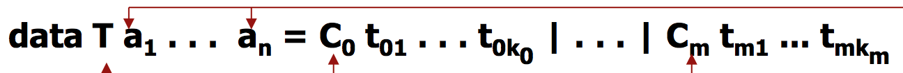
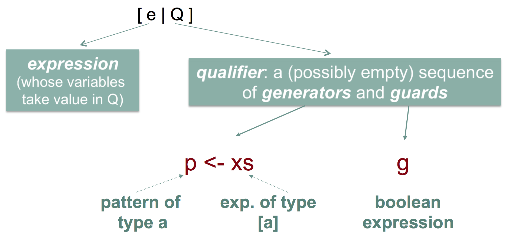

### Why functional programming matters? 
**Many programming languages are borrowing typical functional programming features:**
+ Higher order
+ Lambda abstractions 
+ Map 
+ Partial applications
+ Closures

### Distinctive features
+ Absence of side effects
+ Functions as first-class citizens
+ User defined types and datastructures
+ Partial Application
+ Evaluation Strategies

### No side effects - Functions
Absence of side effects; functions as first-class citizens
+ Absence of side effects
    + `the outcome of a function depends on its arguments *only* (referential transparency) `
+ Functions as first-class citizens
    + `Functions can be arguments of other functions (higher-order) or returned as the outcome of a function call (for instance, by means of a partial application)` 

```haskell
-- higher-order example, being map and sqr two functions (sqr argument of map) 
map sqr [1,2,3]
[1,4,9]

-- partial application example, (Int -> Int) 
map (inc 1) [1,2,3] -- we can see that this is also a higher-order example
[2,3,4]

inc :: Int -> (Int -> Int) 
inc x = (x +) 
```
### Partial Application of functions
Every function f: D<sub>1</sub> x D<sub>2</sub> x … x D<sub>k</sub> -> E
can be presented in *curied* version as follows:
f': D<sub>1</sub> -> (D<sub>2</sub> ->( … -> (D<sub>k</sub> -> E) … )
`where each value in D<sub>1</sub> is given a function of (k-1) arguments (and so on and so forth) 

**Currying** enables the partial application of functions to their arguments 

### Partial aplication of functions
+ In the partial application of a curried function the number of *passed* parameters is *smaller* than the number of *formal* parameters in its definition

```haskell
-- Example: aritmetic operators
(+) :: Int -> Int -> Int    --the function + is defined like this 
$(2 +) 5
7 

-- Example: functions defined as partial applications 
add_2 :: (Int -> Int) 
add_2 = (2 +)
$ add_2 5
7
```
### Evaluation Strategies
+ **<u>Lazy evaluation:</u>** arguments are evaluated only if ***necessary***; termination is guaranteed (when possible)
+ **<u>Eager evaluation:</u>** arguments in a function call are ***all*** evaluated before calling the function 

### Functional types
+ The type constructor -> builds a functional type out from two given types.

```haskell
-- Example
type MyType = (Int -> Int)
fib :: MyType
```
+ In general a<sub>1</sub> -> a<sub>2</sub> -> ... -> a<sub>n</sub> is a functional type whose values are those functions having this type
    + For instance, function **not** is a value of type **Bool -> Bool**
    + The type of function (2 +) is **Int -> Int**
    + The type of function **map** is **(a -> b) -> [a] -> [b]**
+ The operator -> is right associative:
    + a -> b -> c *is equivalent* to a -> (b -> c) *and* ***different*** *from* (a -> b) -> c
+ The functional application operator is left assossiative
    + f a b *is equivalent to* (f a) b *and* ***different*** *from* f (a b) 

### Algebraic Types

```haskell
-- Algebraic Type Example 

type Name = String
type Position = String
type Age = Int
type Course = Int 

data Person = Student Age Name Course | 
              Professor Name Position |
              Director Name

namePerson :: Person -> Name
namePerson (Student e n c) = n 
namePerson (Professor n c) = n 
namePerosn (Director n)    = n 

: namePerson (Professor "Albert" "Assistant") 
"Albert" 
-- If we execute the function namePerson with those parameters it will return n, which in this case is "Albert"
```
The natural numbers can be defined as follows
`data Nat = Zero | Suc Nar` *(which is a recursive declaration)* 

```haskell
-- Arithmetic operators over Naturals
-- ADDITION: 
(+ $) :: Nat -> Nat -> Nat 
x + $ Zero = x
x + $(Suc y) = Suc(x + $y) 

-- MULTIPLICATION 
(* $) :: Nat -> Nat -> Nat 
x * $ Zero = Zero 
x * $(Suc y) = x + $(x*$y) 

-- EXAMPLE OF HOW TO WRITE A BINARY TREE 
-- where L = leaf and B = Branch 

data BinTree a = L a | B (Tree a) (Tree a) 
```
**enumeration**
+ *simple* => **data** Dia = Dom | Lun | Mar | Mie | Jue | Vie | Sab
+ *structured* => data Either = Left Bool | Right Char `where Left Bool and Right Char are Data Constructors`
+ *parametric* => data Either a b = Left a | Right b   `where in "Either a b" : a and b are type variables`

`where T is a Type Constructor; a1 and aN are Type Variables; C0 and Cm are Data Constructors`

+ The values of an algebraic data type are expressions containing constructor symbols only
+ They are obtained by using the type definition as a grammar, so that:
    + Data Constructos  => Terminal symbols
    + Type Constructors => nonterminal symbols
+ Patterns are expressions consisting of constructor symbols and varibales
    + Patterns represent sets of values. For instance, (Suc n) can be usde to represent the set of positive natural numbers 

### Algebraic Types: Pattern matching
+ A expression e matches a pattern p *(pattern matching)* if e is an instance of p (by giving values to the variables in p)
+ Pattern matching is a standard function definition mechanism in functional programs 
+ With pattern matching, functions are defined by describing their outcome for the set of values given by a pattern 

**Some functions defined by pattern matching:**

```haskell
-- Exclusive-or
exOr :: Bool -> Bool -> Bool 
exOr True y = not y 
exOr False y = y 

-- if_then_else
cond :: Bool -> a -> a -> a
cond True x y  = x
cond False x y = y 
```
### Predifined types (Char) 
+ Are written as follows: 
    + 'a','b','0','\n',...
+ Predifined functions for char processing: 
    + ord :: Char -> Int `from character c we get its integer code ord c, ej ord 'b' = 98`
    + chr :: Int -> Char `form an integer we get the corresponding char, ej char 98 = 'b'`
+ More functions:
    + isAlpha, isAlphaNum, isDigit, isUpper :: Char -> Bool 
    + toLower, toUpper :: Char -> Char
    + putChar :: Char -> IO() 

### Predefined types (tuples) 
+ Tuples consist of (two or more) components of possibly different types. eg: (Int, Char) 
+ Functions for tuples of 2 components (pairs) 
    + fst :: (a,b) -> a
    + fst (x,y) -> x
    + snd :: (a,b) -> b 
    + snd (x,y) -> y 

### Predifined types (String) 
**Definition:** type String = [Char]
+ Char sequences enclosed between double quotes
+ Compared by using the lexicographic ordering
+ ` "Juan" < "Juana" => True || "Palo" < "palo" => True`
+ Values of (some) types can be transformed into Strings
+ `show :: Show a => a -> String ; this gives: show 6 => "6"`

### Predifined types (numbers) 
+ Numeric types: Int, Float
    + Int: bounded range integers
    + Float: simple precision floating point real numbers
+ Haskell supports more numeric types [ Integer (unbounded), Double (double precision), Complex, Rational ]

### Algebraic types (lists) 
The predifined type *list* corresponds to a recursive algebraic polymorphic type as follows: 
`data [a] = [] | a : [a]  ; where all a are Type variable, the first ([) and last (]) are Type constructors and symbos [] and : are Data constructors`  
> Remember the data constructor (:) is right associative

### List comprehension 
The notation for list comprehension borrows the usual notation for set-theoretic expressions.
`[ x*x | x <- [1..5], odd x]`
where: 
+ x*x = expression 
+ [1..5] = aritmetic list 
+ "x <- [1..5]" = generator
+ "odd x" = guard 
+ | x <- [1..5], odd x = qualifies



Semantics of list comprehension: 
[ e | p<sub>1</sub> <- xs<sub>1</sub>, g<sub>1</sub>, ..., p<sub>n</sub> <- xs<sub>n</sub>, g<sub>n</sub> ]
+ The generators are used from left to right, where the rightmost one is first changed when necessary 
+ The guards are evaluated from left to right 
+ The returned list collects the value which are obtained when e is evaluated with all variables instantiated by the generators provided that all guards are satisfied on them 
`[(x,y) | x <- [1..5], odd x, y <- [x..5, odd y]`
`Returning values are: [(1,1),(1,3),(1,5),(3,3),(3,5),(5,5)]; because you evaluated the first x which is one then all the list in y until you end the list, after you return to x and look for the next one and repeating with the new values`

```haskell
-- EXAMPLES: 

map f xs = [f x | x <- xs ]

filter p xs = [x | x <- xs, p x ]

repetitions y xs = length [() | x <- xs, y == x ]

divisors n = [i | i <- [1..n], n `mod` i == 0 ]

isMember y xs = not (null [() | x <- xs, y == x ]
```
### Operations on lists 
**Properties of a list**
+ Length of a list: 

```haskell
length :: [a] -> Int 
length []     = 0
length (x:xs) = 1 + length xs 
```
+ Empty list: 

```haskell
null :: [a] -> Bool
null []     = True
null (x:xs) = False
```
**Combinations of lists** 
+ Concatenation: 

```haskell
(++) :: [a] -> [a] -> [a]
[] ++ xs     = xs
(x:xs) ++ ys = x(xs++ys)
```
+ Concatenation with flattening: 

```haskell
concat :: [[a]] -> [a]
concat []       = []
concat (xs:xss) = xs ++ concat xss 
```
+ Combination: 

```haskell
zip :: [a] -> [b] -> [(a,b)]
zip [] xs         = []
zip (x:xs) []     = []
zip (x:xs) (y:ys) = (x,y):zip xs ys 
```
**Componentwise access to a list** 
+ Head of a list: 

```haskell
head :: [a] -> a
head (x:xs) = x
```
+ Last element of a list: 

```haskell
last :: [a] -> a
last [x]    = x
last (x:xs) = last xs
```
+ Indexed access: 

```haskell
(!!) : [a] -> Int -> a 
(x:xs) !! 0 = x 
(x:xs) !! n = xs !! (n-1) 
```
+ Sublists of a list: 
    + Beginnig of a list: `init :: [a] -> [a]` ; all but the last element
    + Tail of a list: `tail :: [a] -> [a]`; all but the first element

> Remember: when you use xs in a recursive function i.e. `example x:xs = x : example xs` . When you use "example xs" the `xs` is the **TAIL** of the list, which means, the **REMAINING** elements of the list 

+ Ordering a list: (by insertion in an ordered list) 

```haskell
insert x []     = [x]
insert x (y:ys) 
        | x <= y    = (x:y:ys)        -- does the same as [x] ++ (y:ys) 
        | otherwise = y : (insert x ys) 

inorder [] = []
inorder (x:xs) = insert x ( inorder xs ) 
```
**More efficient ordering functions: mergeSort** 
+ Procedure: 
    + Divide a list into two halves
    + Order each of the two halves
    + Put together the two ordered halves

```haskell
mergeSort []  = []
mergeSort [x] = [x]
mergeSort xs | size > 0 = merge (mergeSort front) (mergeSort back)  -- defining a function like "aux" 
          where
          size  = length xs `div` 2 
          front = take size xs
          back  = drop size xs

merge :: [Int] -> [Int -> [Int]          
merge a@(x:xs) b@(y:ys)                   -- The @ (alias) is basicly to be able to use the char a or the list (x:xs), to
    | x <= y = x : merge xs b             -- express the same thing, here in "merge xs b" is the same as merge xs (y:ys).
    | otherwise = y : merge a ys          -- This is helpful/efficient in more complex programs where you
merge [] ys = ys                          -- have longer functions ( para que no tengas que escribirlas todo el rato )
merge xs [] = xs
          
-- however this only works if both front and back are smaller than xs 
```
**Transformation of lists** 
+Reverse 

```haskell
reverse :: [a] -> [a]
reverse []     = []
reverse (x:xs) = reverse xs++x
```
+ Application of a function to the components of a list: 

```haskell
map :: (a -> b) -> [a] -> [b]  -- elements transformed by f 
map f [] = []
map f (x:xs) = f x : map f xs 
```
### Coercion 
**Coercion is explicit in Haskell. There are functions that transform some types into others** 
For example: 
+ Function *show* transforms any predefined type into a string. It can be used to coerce integers into strings
`show 3 = "3"` 

### Genericity 
**A funtion is generic if it has a polymorphic type (i.e. : contains type variables) 

```haskell
-- EXAMPLE 

either :: (a -> c) -> (b -> c) -> Either a b -> c
either f g (Left x)  = f x 
either f g (Right y) = g y 
```
### Overloading 
**Overloading is implemented in Haskell through the notion of type classes**
+ Type classes enable the use of parametrization for defining overloade functions for some types which must be included into a type class. Example: 
    + `+ :: Num a => a -> a -> a -> a`
    + Restricts the use of the addition operator to those types belonging to the class Num. 
+ The **type class** declaration specifies the operations that can be used with any type which has been previously included in (i.e., made an instance of) the class. Example: 
    + `class Eq a where`
    + `(==),(/=) :: a -> a -> Bool `
+ The type of overloaded functions includes a reference to the class where the usable types are supposed to be included in advance. Example: 
    + `$ :t (==) `
    + `== :: Eq a => a -> a -> Bool `
+ Each *instance* of a class is obtained by providing an specific implementation of the class operations for the targeted type.

```haskell
-- EXAMPLE 

data Nat = Cero | Suc Nat
      instance Eq Nat where
      Cero == Cero   = True
      Suc x == Suc y = x == y       -- (Suc x == Suc y) = ( x == y ) 
      _ == _         = False
```
+ Algebraic types can be added to a type class by using a *deriving* clause in the type definition. Example: 
    + `data Bool = False | True deriving (Eq, Ord, Enum)`
    + The operations are given an implementation on the basis of the syntactic structure of the type definition (for instance, False < True) 

### Some predefined classes
+ Eq ((==),(/=))
    + includes all predefined types except IO, (->) 
+ Ord ((<), (<=), (>), (>=), max, min) 
    + includes all predefined types except IO, IOError, (->) 
+ Num ((+),(-),(\*),negate,abs,signum,...) *(signum returns the sign of the number)*
    + includes all numeric types (Int, Integer, Float, Double, Ratio) 
+ Show(show,...)
    + includes all predefined types except IO, (->) 

### Class inheritance
+ Inheritance can be used to define some classes
    + Example: Ord is a subclass of Eq that provides a default implementation of <=,>=,> as follows:  

```haskell
class (Eq a) => Ord a where
      (<),(<=),(>=),(>) :: a -> a -> Bool 
      x <= y      = (x<y) || (x==y) 
      x >= y      = (x>y) || (x==y) 
      x >  y      = not (x <= y) 
```
+ Instances of extended classes can be defined using *instance*

```haskell
-- EXAMPLE

instance (Eq Nat) => Ord Nat where
Cero  < Suc x  = True
Suc x < Sux y = x < y
_ < _         = False
```
`Note: the context "(Eq Nat) =>" is not necessary because Ord extends Eq, but Eq should be instantiated with Nat before instantiating Ord with Nat`

### Class instances
+ Dealing with generic types, we may need contexts (witnessing class membership) for their arguments

```haskell
-- EXAMPLE
data Figure = Circle Float | Rect Float Float deriving (Eq, Ord, Show) 
```
`float must be an instance of Eq, Ord, Show (and it is prefefined that way)`

```haskell
-- EXAMPLE 
data Tree a = Void | Branch a (Tree a)(Tree a) 
instance (Eq a) => Eq (Tree a) 
Void              ==                  = True
(Branch x l1 r1 ) == (Branch y l2 r2) = (x==y) && (l1 == l2) && (r1 == r2) 
_                 == _                = False 
```
`a must be an instance of Eq so that == (as used in the second equation) is overloaded for values of type a, you must import it with "deriving" (I think) `


> SPACE
